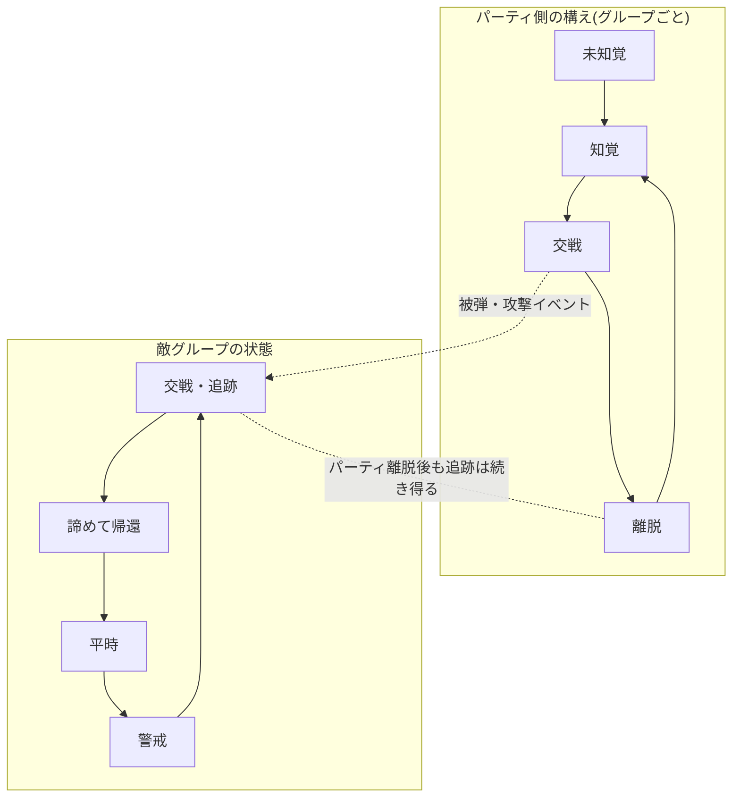

# ADR-0008: グループ単位の知覚と、知覚・交戦の分離

- **決定日**: 2026-07
- **関連コード**: `AEnemyGroup` (`Enemies/Group/`) / `UPartyPerceptionComponent` (`Party/`) /
  `AEnemySpawner` (`Enemies/Spawning/`)
- **先行決定**: ADR-0006(グループ境界はスポーンデータが決める)、ADR-0005(空間ハッシュ)

---

## 1. 要約

> スポーンプールが決めた敵の「群れ」を、ランタイムの実体 `AEnemyGroup` として立てる。
> 味方の敵知覚は**グループ単位** — 1体でも見つければ群れ全体を知覚したことになる。
> そして「知覚」と「交戦」は一つの共有状態ではなく、**双方が別々に持つ非対称な状態**とし、
> 側を跨ぐのは状態ではなくイベントだけにする。

## 2. 問題

スポーンで群れとして配置された敵は、スポーン後はただの個体の集まりで、
「この群れは全滅したか」「群れとして警戒しているか」を尋ねる相手がいなかった。

また、目指す戦闘の見え方を並べると、知覚と交戦は一体にできない:

- 仲間が敵に気づいたが、交戦せず素通りする
- 敵は味方に気づいて警戒するが、まだ襲ってこない
- 味方が戦闘を無視して離脱する中、敵は追いかけ、やがて諦めて戻る

「交戦開始で即突撃、終了で即帰還」が古臭く見えるのは、この中間状態が無いからだ。
さらに交戦すら対称ではない — 味方が仕掛ければ敵は必ず交戦状態になるが、
敵が交戦中でもプレイヤーは無視して進める。

## 3. 検討して捨てた案

- **スポーナーにグループ機能を持たせる**: 一番手軽だが、配置係だったスポーナーが
  戦闘の指揮者になってしまい、寿命も責務も混ざる。スポーナーは「生成して登録したら手を引く工場」に留めた。
- **軽量オブジェクト + 中央管理システム**: グループが自分の鼓動(定期的な感知や状態遷移)を
  持てず、結局すべて中央管理者が代行することになる。「戦略はグループに割り当てる」
  (ADR-0006)と逆方向。将来のグループ用StateTreeを載せる土台も無い。
- **共有の「交戦オブジェクト」**: 「パーティは離脱中・敵は追跡中」という一番見せたい
  非対称な場面が、単一状態では表現できず例外フラグだらけになる。独立した状態を
  双方に持たせれば、非対称は例外ではなく標準の表現になる。

## 4. 最終決定

- `AEnemyGroup`(描画を持たない情報Actor)がメンバー名簿とグループ状態の唯一の持ち主。
  所属は生成時に一度だけ注入され、実行中に「自分の群れはどれか」を計算するコードは存在しない。
- 味方の知覚はプレイヤー基準の半径判定(進入半径 < 離脱半径のヒステリシス付き)。
  1体でも入れば群れ全体を知覚に昇格。
- 依存方向は一方通行: パーティ側は敵グループを**読むだけ**、敵側はパーティの型を一切知らない。
  敵の警戒・交戦は「自分の感知」と「被弾イベント」だけで変化する。
  だから「味方は気づいたが敵は知らない」が自然に成立する。

## 5. 敵側の実装方針(次の段階)

敵グループの状態遷移(平時/警戒/交戦/帰還)は、グループ自身の低頻度な感知と、
メンバーの被弾がグループへ上がるイベントの2経路だけで駆動する。
キョロキョロ見回す・とぼとぼ帰るといった見た目の演出は、個体の行動AI(StateTree)の段階で載せる。

## 6. 残る限界

- 知覚スキャンは全グループ巡回(スポーン地点規模なら十分)。数が増えたら
  空間ハッシュ(ADR-0005)照会に内部だけ差し替える。
- 死亡判定は当面「Actor破壊=死亡」。HP導入時に内部だけ差し替える。

## 7. 既存ADRとの関係

ADR-0006が決めた「グループ境界=配置データ」を、ランタイムの実体として立てたのが本ADR。
ADR-0007(スポーン時の初期配置)の次の段階にあたる。