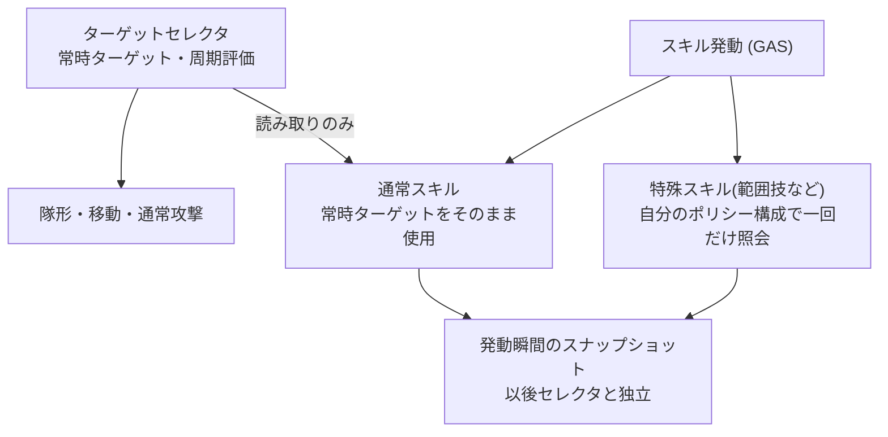

# ADR-0009: 重み付きターゲットポリシーとキャラ別セレクタ

- **決定日**: 2026-07
- **関連コード**: `ITargetable` / `UTargetScorePolicy` 系 / `UTargetSelectorComponent`(抽象) +
  `UPartyTargetSelectorComponent` (いずれも `AI/Targeting/`)
- **先行決定**: ADR-0002(交換可能な戦略オブジェクト)、ADR-0003(評価は継続・決定は粘る)、
  ADR-0008(知覚レイヤー)

---

## 1. 要約

> 「誰を狙うか」を、0〜1 の点数を返す小さな**ポリシー**の重み付き組み合わせにする。
> キャラごとに組み合わせと再評価の周期が異なり、それがそのままキャラの個性になる。
> 仕組み自体は陣営を知らず、敵側のターゲット選定にも、将来のスキル(GAS)の照準にも
> 同じ部品を使い回せる。**選定は選定だけ — 立ち位置は決めない(それは隊形の仕事)。**

## 2. 問題

- 「プレイヤーと同じ敵を狙う」「近い敵から」「味方と同じ敵に加勢」といった性向を、
  コード分岐ではなくデータの組み合わせで表現したい。
- パーティ全員が同じ瞬間にターゲットを切り替えると「プログラムが動いている」と
  画面から見えてしまう。切り替えの鼓動は一人ひとりズレているべきだ。
- 包囲などの連携は「たまたま同じ敵を選んだ結果」であって、強制ではない。
- 敵側のターゲット選定がすぐ次に控えているため、陣営の知識を評価の中心部に
  染み込ませてはいけない。

## 3. 検討して捨てた案

- **具体型へのキャスト / タグでの判定**: 型キャストは結合の引っ越しにしかならず、
  タグは「狙えるか」は表せても包囲半径のような*データ*を運べない。
  → 陣営中立の契約 `ITargetable`(狙えるか + 包囲半径)を採用。
- **中央(パーティ管理)が評価材料を各自へ配る(Push)**: 配る側の鼓動に評価が縛られ、
  「ズレた周期」という核心が崩れる。→ 各自が評価の瞬間に取りに行く(Pull)。
  例外はターゲット消滅の通知だけイベントで受ける。
- **ターゲット切替の抑制(マージン・最低維持時間)**: 検討の末、**あえて入れなかった**。
  移動した結果さらに近い敵へ切り替わるのは故障ではなく、乱戦の躍動感そのものだ。
  代わりに切替ログ(誰が・何から何へ・理由)を仕込み、実際に目障りかを観測してから判断する。

## 4. 最終決定

- **ポリシーはステートレス(無状態)**: ポリシーが持てるのはエディタで決める設定値だけで、
  実行中に変わる記憶(直前のターゲット等)は持たない。BPで編集するポリシーは
  テンプレート上の実物オブジェクトで、スポーンごとにその複製が配られる —
  複製は設定と状態を区別しないため、状態を持たせると「テンプレートに偶然残った値」が
  全スポーンの初期状態として複製されてしまう。状態はすべてセレクタ側が持つ。
- **抽象セレクタ + 陣営別の子**: 評価ループ(周期・確定・ログ)は共通で、陣営差は
  「材料をどこから集めるか」の2箇所だけ。敵側は次段階でこの2箇所を実装して合流する。
- **ズレた鼓動**: 再評価周期はキャラの性格値。周期は毎回ランダムに揺らし、全員の
  評価タイミングが揃わないようにする。ターゲットを失った時だけ周期を待たず、
  ただしランダムな「反応の遅れ」を一拍挟む — 全員が同一フレームで切り替わる機械感を防ぐ。

- **常時ターゲットと瞬間ターゲット**: 隊形や通常攻撃が読むのは常時ターゲット。
  範囲技のような特殊スキルは、発動の瞬間に自分専用のポリシー構成で一回だけ対象を選ぶ。
  スキルの選択が常時ターゲットを書き換えることは原則ない(書き換えが機能そのものである
  ロックオン系のみ例外)。ポリシーが無状態だからこそ、同じ部品を周期評価と一回照会の
  両方で衝突なく使い回せる。

## 5. 残る限界

- 密集優先ポリシーは、スキル照会の形が決まるGAS段階で一緒に設計する。
- 隊形側はまだパーティ単一ターゲットのみ消費する(リーダーの選定結果を代表として渡す
  暫定接続)。メンバー個別ターゲットの消費が次の隊形作業。

## 6. 既存ADRとの関係

交換可能な戦略部品(ADR-0002)と「評価は継続・決定は粘る」(ADR-0003)の系譜を
ターゲット選定で反復した。共有アセット化をしない判断はADR-0007(その場で直接編集)の延長。
候補の供給元はADR-0008の知覚レイヤーで、陣営を跨がない依存方向もそこから引き継いだ。