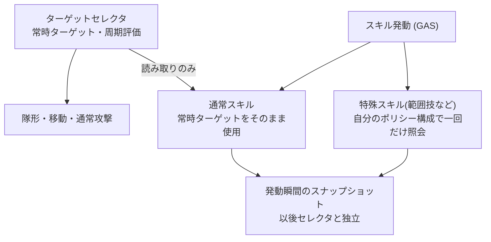

# ADR-0009: 重み付きターゲットポリシーとキャラ別セレクタ

- **決定日**: 2026-07
- **関連コード**: `ITargetable` / `UTargetScorePolicy` 系 / `UTargetSelectorComponent`(抽象) +
  `UPartyTargetSelectorComponent` (いずれも `AI/Targeting/`)
- **先行決定**: ADR-0002(交換可能な戦略オブジェクト)、ADR-0003(評価は継続・決定は粘る)、
  ADR-0008(知覚レイヤー)

---

## 1. 要約

> 「誰を狙うか」を、0〜1 の点数を返す小さな**ポリシー**の重み付き組み合わせにする。
> キャラごとに組み合わせと再評価の周期が異なり、それがそのままキャラの個性になる。
> 仕組み自体は陣営を知らず、敵側のターゲット選定にも、将来のスキル(GAS)の照準にも
> 同じ部品を使い回せる。**選定は選定だけ — 立ち位置は決めない(それは隊形の仕事)。**

## 2. 問題

- 「プレイヤーと同じ敵を狙う」「近い敵から」「味方と同じ敵に加勢」といった性向を、
  コード分岐ではなくデータの組み合わせで表現したい。
- パーティ全員が同じ瞬間にターゲットを切り替えると「プログラムが動いている」と
  画面から見えてしまう。切り替えの鼓動は一人ひとりズレているべきだ。
- 包囲などの連携は「たまたま同じ敵を選んだ結果」であって、強制ではない。
- 敵側のターゲット選定がすぐ次に控えているため、陣営の知識を評価の中心部に
  染み込ませてはいけない。

## 3. 検討して捨てた案

- **具体型へのキャスト / タグでの判定**: 型キャストは結合の引っ越しにしかならず、
  タグは「狙えるか」は表せても包囲半径のような*データ*を運べない。
  → 陣営中立の契約 `ITargetable`(狙えるか + 包囲半径)を採用。
- **中央(パーティ管理)が評価材料を各自へ配る(Push)**: 配る側の鼓動に評価が縛られ、
  「ズレた周期」という核心が崩れる。→ 各自が評価の瞬間に取りに行く(Pull)。
  例外はターゲット消滅の通知だけイベントで受ける。
- **ターゲット切替の抑制(マージン・最低維持時間)**: 検討の末、**あえて入れなかった**。
  移動した結果さらに近い敵へ切り替わるのは故障ではなく、乱戦の躍動感そのものだ。
  代わりに切替ログ(誰が・何から何へ・理由)を仕込み、実際に目障りかを観測してから判断する。

> ⚠️ **後からの補足（2026-08改訂、下の7章）：** ここで仕込んだ「観測してから判断」が
> 発動した。実測で、点数の揺れがそのままターゲットの往復として見える振動が確認され、
> 抑制を導入した ── ただし点数のマージンではなく、**ポリシーごとの維持時間（ホールド）**
> という時間の形で。評価一回ごとの切替マージンは今も入れていない。

## 4. 最終決定

- **ポリシーはステートレス(無状態)**: ポリシーが持てるのはエディタで決める設定値だけで、
  実行中に変わる記憶(直前のターゲット等)は持たない。BPで編集するポリシーは
  テンプレート上の実物オブジェクトで、スポーンごとにその複製が配られる —
  複製は設定と状態を区別しないため、状態を持たせると「テンプレートに偶然残った値」が
  全スポーンの初期状態として複製されてしまう。状態はすべてセレクタ側が持つ。
- **抽象セレクタ + 陣営別の子**: 評価ループ(周期・確定・ログ)は共通で、陣営差は
  「材料をどこから集めるか」の2箇所だけ。敵側は次段階でこの2箇所を実装して合流する。
- **ズレた鼓動**: 再評価周期はキャラの性格値。周期は毎回ランダムに揺らし、全員の
  評価タイミングが揃わないようにする。ターゲットを失った時だけ周期を待たず、
  ただしランダムな「反応の遅れ」を一拍挟む — 全員が同一フレームで切り替わる機械感を防ぐ。

- **常時ターゲットと瞬間ターゲット**: 隊形や通常攻撃が読むのは常時ターゲット。
  範囲技のような特殊スキルは、発動の瞬間に自分専用のポリシー構成で一回だけ対象を選ぶ。
  スキルの選択が常時ターゲットを書き換えることは原則ない(書き換えが機能そのものである
  ロックオン系のみ例外)。ポリシーが無状態だからこそ、同じ部品を周期評価と一回照会の
  両方で衝突なく使い回せる。

## 5. 残る限界

- 密集優先ポリシーは、スキル照会の形が決まるGAS段階で一緒に設計する。
- 隊形側はまだパーティ単一ターゲットのみ消費する(リーダーの選定結果を代表として渡す
  暫定接続)。メンバー個別ターゲットの消費が次の隊形作業。

> ⚠️ **後からの補足（2026-08）：** 上の宿題は閉じた ── ただしグループ分け**なしで**。
> グループは場所の束をまとめて割り当てるためにあったが、隊形側が全員「一人ずつ」型に
> なってその割り当て自体が消えたからだ（ADR-0003の8章）。各メンバーが自分のセレクタの
> ターゲットをそのまま読み、リーダー経由の暫定接続も取り除いた。

## 6. 既存ADRとの関係

交換可能な戦略部品(ADR-0002)と「評価は継続・決定は粘る」(ADR-0003)の系譜を
ターゲット選定で反復した。共有アセット化をしない判断はADR-0007(その場で直接編集)の延長。
候補の供給元はADR-0008の知覚レイヤーで、陣営を跨がない依存方向もそこから引き継いだ。

---

## 7. 改訂（2026-08）：時間の構造 — ポリシーごとの維持時間と組み合わせの調整文法

### 7.1. 問題 — 毎回の評価が、毎回の切替の機会だった

セレクタに時間の構造が無かったので、点数が揺れればそのままターゲットが揺れた。
実測で三つのことが分かった。

- **距離どうしの組み合わせは結果が分かれない。** 「自分に近い敵」と「リーダーに近い敵」を
  混ぜてみたが、パーティは固まって動くので二つの距離はほぼ同じ値になる。順位がほぼ同じ
  なら、重みをどう変えても勝者は変わらない ── 組み合わせの仕組みは生きているのに、
  意味のない組み合わせが存在することを仕組みは止めてくれない。
- **人が動かす値を点数に載せると振動する。** 候補からリーダーまでの距離を常時採点したら、
  プレイヤーが敵の間を行き来するだけで味方のターゲットが往復した。隊形側で学んだ
  「プレイヤーをきっかけに入れるな」（ADR-0003）と同じ病がターゲット選定で再発した ──
  リーダーの位置は人の手が毎瞬動かす速い値なので、生のまま点数の大きさに入れてはいけない。
- **重みが優先順位に変質する領域がある。** 「リーダーが狙っている敵か」のような0か1の
  信号と、距離のような連続の点数を混ぜるとき、点数は0〜1に収まるので、信号側の重みが
  連続側より大きいと連続側は絶対に覆せない ── 重みをいくら上げても動きが同じ、死んだ
  調整領域になる。比が1未満のときだけ「どれだけ確実に良ければ乗り換えるか」の余白として働く。

### 7.2. 決定

**① ポリシーごとの維持時間（ホールド）— 決定の性格が、信頼する時間を決める。**
評価で勝ったターゲットを確定するとき、その決定を主導したポリシー（勝者への寄与が最大の
もの）が宣言した秒数だけ、再評価を休む。復帰のような慎重な決定は長く、目の前の敵のような
即興の決定は短く ── 維持時間はポリシーの性質なので、既定値は各ポリシーが宣言し、
キャラごとの調整は編集で開く。点数マージンではなく時間を選んだ理由：マージンは点数差
という連続量に敷居を置くもので、組み合わせや曲線が変わるたび意味が変わるが、時間は
「この決定を何秒信じるか」とそのまま読める単位だからだ。切替がどれだけ競り合っても、
頻度に上限がかかる。ターゲットの死亡・資格喪失はホールドを無視して即座に再評価を予約する
── 死んだ的を維持時間ぶん見つめてはいけない。ホールドと評価周期のタイマーは別々に流す：
ホールド明けの瞬間に評価すると、同じホールドを始めたキャラたちが同じフレームで同時に
再評価し、せっかくズラした鼓動がまた揃ってしまうからだ。

**② リーダー距離ポリシーの作り直し — 人が動かす値は、点数の大きさから外す。**
「リーダーに近い敵」ポリシーは「復帰の性向」として定義し直した。自分からリーダーまでの
距離（味方は目的を持って動くので、ゆっくり変わる値）でポリシー全体に門を掛ける ──
リーダーの近くに居る間は点数0で沈黙して他のポリシーだけが働き、離れるほど曲線に沿って
開いて、リーダー付近の敵に加点しそちらを狙って戻らせる。曲線はべき乗：少し離れた程度には
鈍く、確実に離れたときに急に立ち上がり、中途半端な距離で中途半端に口を挟むのを減らす。
試して捨てた案：候補の判定を「リーダーの半径内なら1、外なら0」の二値にして揺れ自体を
消す方式 ── 振動は消えたが、ホールドが入って抑制を時間が担うようになると二重の抑制に
なり、半径の境目でちらつく癖だけが残った。抑制はホールドに任せ、判定は連続に戻した。
セレクタに「あるポリシーが敷居を超えたら優先」のような二段の分岐を入れる案も検討して
却下 ── ポリシーが互いを知らず候補ごとに独立に採点するという約束が組み合わせの根拠で、
そこに優先順位の分岐を混ぜると、一つの仕組みの中に別々の評価規則が二つ並ぶことになる。

**③ 組み合わせの調整文法（仕組みが止めてくれないことの記録）。**
同じ種類の連続軸は一つだけ土台に敷く ── 距離系を二つ混ぜるのは意味のない組み合わせだ。
キャラの個性は種類の違う軸（約束・付き合い・復帰の性向）の重みで出す。0か1の信号の
重みは、連続の土台に対して1未満で使う ── 1以上は優先順位の宣言であり、それが意図なら
そうと分かって使う。

### 7.3. 残る限界

- ホールド中のターゲットが知覚範囲を出ても、生きている限り維持される。遠くへ逃げた敵を
  数秒追う絵が出うる ── 実測で目障りなら距離の上限による破棄を開く。
- ホールド明けの再評価には今もマージンが無い。際どい状況では明けるたびに乗り換えうるが、
  その頻度自体にホールドで上限がかかっている。
- 「リーダーのターゲット」は、リーダーというキャラのAIセレクタが選んだものであって、
  プレイヤーが実際に殴っている相手ではない。人はセレクタと別の敵を殴れるので、リーダー
  追従の性向が「プレイヤーが殴っている敵」とズレうる。攻撃イベントから意図を供給するのは
  戦闘アクション（GAS）側の作業で、材料の組み立て側がその供給元を優先して読む席だけ
  用意してある。

### 7.4. 既存ADRとの関係

- **ADR-0003：** 「評価は継続・決定は粘る」の時間構造がターゲット選定にも届いた。
  隊形はゲート、ターゲットは観測のみ ── という対比は、この改訂で半分が過去の記述に
  なった。ターゲットも粘るようになり、ズレた鼓動はそのままだ。
- **ADR-0003の8章（同時期の改訂）：** 層をまたぐ振動を両側から断った。隊形側は
  ターゲットの切替が全員の再配置へ広がる増幅を消し、ターゲット側は切替の頻度そのものに
  上限を掛けた。片方だけでも無限の振動は死ぬが、両方あってはじめて一回の切替も局所で
  終わる。