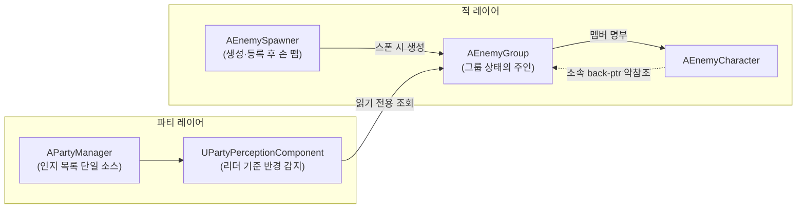
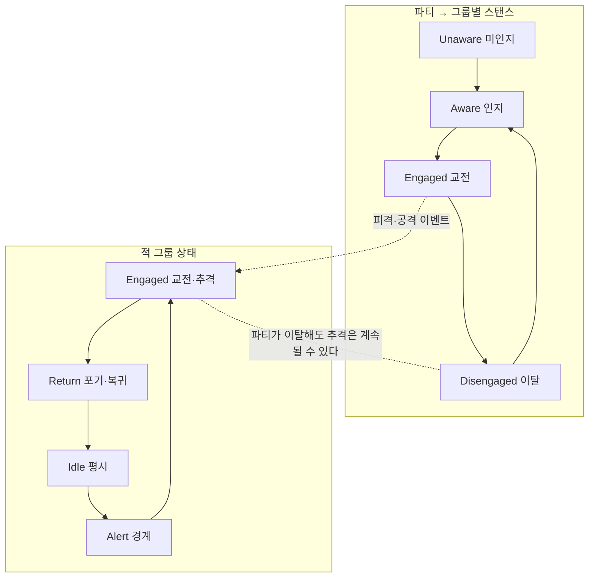

# ADR-0008: 그룹 단위 인지와 인지·교전의 분리 — 적 그룹을 런타임 1급 객체로

> 작성 원칙 (README_ko와 동일): 압축해서 적으면 몇 주 뒤에 내가 못 읽는다. 결정은 "왜"를
> 문장으로 풀어쓴다. 변수명·내부 함수명 같은 구현 디테일은 적지 않는다 — 이 문서가
> 가리키는 건 "어느 클래스가 무슨 책임을 지는가"까지다.

- **결정일**: 2026-07
- **관련 코드 (길 찾기용 앵커)**:
    - `AEnemyGroup` (`Enemies/Group/`) — 적 그룹의 런타임 실체. 멤버 명부와 그룹 상태의 유일한 소유자
    - `UPartyPerceptionComponent` (`Party/`) — 파티의 적 그룹 인지. 리더 기준 반경 감지
    - `AEnemySpawner` (`Enemies/Spawning/`) — 스폰 시 그룹을 생성·등록하고 손을 떼는 공장
- **선행 결정**:
    - ADR-0006 (그룹 경계는 스폰 데이터가 만든다 — 이 ADR은 그 경계를 런타임 객체로 실체화한다)
    - ADR-0005 (SpatialHashGrid — 미래에 이 그룹들을 색인할 조회 레이어)

---

## 1. 한 줄 요약

> 스폰 풀이 정한 그룹 경계를 `AEnemyGroup`(AInfo)이라는 런타임 객체로 세우고, 파티의 적 인지를
> **그룹 단위**로 한다 — 한 마리라도 감지되면 그 그룹 전체를 인지한 것으로 승격.
> 인지와 교전은 하나의 공유 상태가 아니라 **양측이 각자 가지는 비대칭 상태**이며,
> 측을 건너는 것은 상태가 아니라 이벤트뿐이다.

---

## 2. 맥락 (왜 이 결정이 필요했나)

### 2.1. 그룹이라는 실체가 없었다

ADR-0006/0007로 적은 스폰 풀 단위로 진형을 갖춰 배치되지만, 스폰이 끝나면 그 "무리"는
런타임에 아무 실체가 없었다. 그런데 앞으로의 모든 적 관련 요구가 그룹을 전제한다:

- 파티가 무리 중 한 마리를 발견하면 그 무리 전체와의 전투가 성립해야 한다 (한 마리씩
  순차 발견되는 어색함 방지)
- 적 그룹 전략(ADR-0006의 포위/C 등)을 배정받을 주체가 필요하다
- "이 무리가 전멸했는가"를 물을 곳이 필요하다

멤버 명부, 그룹 상태, (미래의) 그룹 전략 — 이걸 누가 들고 있느냐가 이번 결정의 중심이다.

### 2.2. 인지와 교전은 같은 것이 아니다

원하는 인게임 장면을 나열해 보면 인지와 교전이 한 덩어리일 수 없다:

- 동료들이 적을 인지했지만 교전을 시작하지 않고 지나친다
- 적이 아군을 인지하고 경계에 들어가지만, 아직 달려들지는 않는다
- 아군이 교전을 무시하고 이탈하는 중인데, 적은 쫓아오다 포기하고 돌아간다
- 아군이 먼저 발견하고 선제 타격 → 그제야 적도 인지하고 교전 시작

"교전 시작! 하면 칼 들고 직진, 교전 끝! 하면 즉시 스폰 지점 복귀"가 구식으로 보이는
이유가 바로 이 상태들의 부재다. 인지 시점은 양측이 서로 다를 수 있고, 교전이 시작되면
서로를 인지하게 되는 것만 공통이다. 또한 교전조차 대칭이 아니다 — 아군이 교전을 걸면
적은 반드시 교전 상태가 되지만, 적이 교전 중이어도 아군(플레이어)은 무시하고 이동할 수 있다.

### 2.3. 인지의 기준은 플레이어

전투의 시작과 이탈을 플레이어 기준으로 결정하고 싶다. 플레이어 범위에 안 들어왔는데
동료만 따로 적을 인지하는 상황은 만들지 않는다 (동료 개별 시야는 현재 목표가 아니다).

---

## 3. 결정과 그 이유

### 3.1. 그룹의 그릇 — `AEnemyGroup`은 AInfo 파생 액터

그룹 상태를 담을 그릇의 후보는 세 가지였고, AInfo 액터를 택했다.

결정적 근거는 두 가지다. 첫째, **그룹은 자기 행동을 가져야 한다.** 경계 진입 판정 같은
저주기 감지, 상태 전이, 나중엔 그룹 전략까지 — 이걸 그룹 스스로 돌리려면 자기 생명주기
(BeginPlay/EndPlay)와 박동(Tick)이 필요하고, 그건 액터의 것이다. 둘째, **미래의 그룹
StateTree에게 몸통이 필요하다.** `UStateTreeComponent`는 액터 컴포넌트라 액터에만 붙는다.
그룹 전략 상태 머신은 로드맵의 확정 항목이므로, 이건 숨은 확장이 아니라 명시된 확장축이다.
AInfo는 렌더링·충돌이 없는 순수 정보 액터라 그 몸통으로 정확히 맞는다.

### 3.2. 스포너는 공장, 그룹이 지휘자

스포너가 스폰 목록을 이미 들고 있으니 그룹 로직을 스포너에 붙이는 게 코드는 가장 짧다.
하지만 그러면 스포너가 그룹 AI의 지휘자가 되고, 그룹 수명이 스포너 수명에 묶인다.
스폰(배치)과 지휘(전투)는 다른 책임이다.

그래서 스포너는 스폰 시 그룹 액터를 생성하고 멤버를 등록해 준 뒤 손을 뗀다.
ADR-0006의 "그룹 경계는 배치 데이터가 정한다"는 그대로 지켜지면서(스포너가 경계를
*만들고*), 지휘는 그룹의 것이 된다(스포너가 경계를 *운영하지 않고*). 나중에 스크립트
이벤트로 스폰되는 적도 같은 그룹 클래스를 쓸 수 있다 — 스포너는 여러 생산자 중 하나일 뿐이다.

### 3.3. 소속은 계산하지 않는다 — 중복 로직의 원천 차단

"EnemyA가 인지되면 A가 속한 그룹 전체를 파악한다"는 로직을 각 적이 들고 있으면, 적 수만큼
같은 파악 로직이 도는 중복이 생긴다. 이 중복을 없애는 방법은 파악 로직을 잘 짜는 게 아니라
**파악할 필요 자체를 없애는 것**이다:

- **소속은 스폰 시점에 주입된다.** 그룹 등록이 멤버에게 back-ptr(약참조)를 꽂아주는
  단일 경로이며, 런타임에 "내 그룹이 누구지?"를 계산하는 코드는 존재하지 않는다.
  포인터 한 홉이 전부다.
- **그룹 상태는 그룹에 한 번만 저장된다.** 경계·교전 같은 상태는 멤버 N명이 각자 들지
  않고 그룹 객체에 1회 저장, 감지 체크도 그룹이 저주기로 1회 돌린다. 멤버는 그룹 상태를
  읽거나 통지받기만 한다.

### 3.4. 파티 인지 — 리더 기준 반경, 그룹 단위 승격, API 계약 유지

`UPartyPerceptionComponent`가 리더(=플레이어) 위치 기준 반경으로 감지한다. 진입 반경
이탈 반경의 히스테리시스로 경계 깜빡임을 막는다 (모드 전환 히스테리시스와 같은 문법).
감지 대상 순회는 월드의 그룹 전체를 저주기 스캔 — 그룹 수는 스폰 지점 규모라 충분하고,
LOD 도입 시 SpatialHashGrid(ADR-0005) 조회로 내부만 교체한다.

핵심 규칙: **적 1체라도 진입 반경에 들어오면 소속 그룹 전체를 인지로 승격한다.**
감지된 액터에서 back-ptr로 그룹을 얻고, 그룹의 생존 멤버 목록을 읽는 방식이다.

파티 허브의 기존 조회 API("살아있는 적만 반환")는 시그니처·계약 그대로 두고 내부 공급만
교체했다. 모드 결정과 Formation 컴포넌트들은 이 변경을 모른다.

### 3.5. 의존 방향 규칙 — 파티→적그룹 읽기 전용, 적→파티 없음

파티가 그룹을 인지해도 그룹에 아무것도 **쓰지 않는다.** 파티의 인지는 파티만의 지식이고,
적이 알아챌 일이 아니다 — "아군은 인지했는데 적은 모른다"는 비대칭이 이 규칙에서 공짜로
나온다. 적 레이어는 파티 타입을 일절 include하지 않는다. 적의 경계·교전 전이는 오직
① 자기 감지와 ② 피격 이벤트(Instigator를 `AActor*`로 받으므로 파티 타입 의존 없음)로만
일어난다. 그룹↔멤버의 상호 참조는 소유자/자식 관계로, 명부의 주인은 그룹이고 멤버는
약참조 back-ptr만 가진다.

### 3.6. 인지·교전 상태의 형태 — 양측 각자, 교차는 이벤트만

"교전이 시작되면 서로를 인지한다"도 공유 상태가 아니라 이벤트 전파 규칙 하나다.
비대칭의 대표 장면(파티 Disengaged + 적 Engaged 추격)은 두 머신이 독립이라 그냥 표현된다.

---

## 4. 기각한 대안

### 대안 A: 스포너에 그룹 컴포넌트 부착

가장 편한 위치지만, 스포너가 그룹 AI의 지휘자가 되고 그룹 수명이 스포너에 묶인다.
배치 책임과 전투 지휘 책임이 한 클래스에 섞인다. §3.2의 이유로 기각.

### 대안 B: UObject 그룹 + WorldSubsystem 레지스트리

그룹을 가벼운 UObject로 두고 서브시스템이 등록·조회를 맡는 방식. 액터보다 가볍다는
장점이 있지만 치명적인 결함이 둘이다. 첫째, UObject는 자기 생명주기·틱이 없어 감지와
상태 전이를 전부 서브시스템이 대신 돌려줘야 하고, 그러면 행동의 주체가 그룹이 아니라
중앙 관리자가 된다 — ADR-0006의 "전략은 그룹에 배정된다"와 정반대 방향. 둘째,
UObject는 컴포넌트를 못 가지므로 미래의 그룹 StateTree를 붙일 몸통이 없다.
서브시스템 자체는 기각이 아니라 보류다 — 파티 인지가 감지된 액터에서 그룹으로 거슬러
올라가는 현재 구조에선 전역 레지스트리가 필요 없고, LOD(ADR-0005) 도입 시 조회
레이어로 들어올 자리다.

### 대안 C: 공유 Encounter 객체

"파티와 그룹 X의 교전"을 하나의 객체·하나의 상태로 두는 방식. 문제는 목표 연출의
핵심이 비대칭이라는 점이다. 상태가 하나면 "파티는 이탈, 적은 추격 중"인 순간
"교전 중인가?"에 답이 없어지고, 보조 플래그를 덧대야 표현이 된다. 그러면 가장 원하는
연출이 가장 어색한 예외 경로가 되고, 비대칭 시나리오가 늘 때마다 플래그가 증식하며,
"Encounter 종료"의 의미가 읽는 사람마다 달라진다. 독립 상태 머신 둘이면 비대칭이
특수 케이스가 아니라 기본 표현이다.

### 대안 D: UAIPerceptionComponent

UE 내장 인지는 AIController 구동의 시야각·자극(stimulus) 모델이다. 내 규칙은
"플레이어 기준 반경"이라는 결정론적 정의라 이 모델이 오히려 어긋나고, 플레이어는
AIController가 없다. 시야각·소리 인지가 필요해지면 그때 인지 컴포넌트의 내부 구현만
교체한다 — 외부 API 계약은 이미 그 교체를 전제로 고정해 두었다.

---

## 5. 적 측 시스템의 구현 방향 (다음 단계)

이번 구현은 그룹 실체 + 파티 측 인지까지다. 적 측은 다음 순서로 같은 골격 위에 올린다:

- **적 그룹 상태 머신** (Idle/Alert/Engaged/Return): 상태는 `AEnemyGroup`에 1회 저장.
  전이는 ① 그룹이 저주기로 돌리는 자기 감지(가장 가까운 멤버↔파티 거리)와
  ② 멤버 피격 이벤트가 그룹으로 올라오는 경로 두 개로만 구동한다. enum을 미리 넣지 않은
  것은 전이를 구동할 감지가 없는 상태에서는 테스트 불가능한 코드가 되기 때문이다.
- **적 타겟팅**: ADR-0009의 셀렉터 골격을 재사용한다. 진영 차이는 재료 공급 훅 두 개뿐이며,
  적 측 공급원은 그룹의 인지 목록이 된다.
- **Alert/Return의 연출**(두리번거림, 복귀 이동)은 적 개별 행동(StateTree) 단계의 몫이다.
  상태 정의와 연출 구현을 분리해 두면 상태 머신을 먼저 검증할 수 있다.

---

## 6. 결과 (얻는 것 / 치르는 것)

**얻는 것:**

- 그룹에 관한 모든 질문(멤버, 생존, 전멸, 상태)의 답이 한 곳에 모인다
- 인지가 그룹 단위라 "한 마리 발견 = 무리와의 조우"가 자연스럽다
- 비대칭 인지·교전 연출의 상태 표현이 기본형이 된다
- 의존 방향이 단방향이라 적 레이어를 파티와 무관하게 확장할 수 있다

**치르는 것 / 지켜볼 것:**

- 파티 인지의 전 그룹 순회 스캔은 스폰 지점 규모 전제다. 그룹 수가 늘면
  SpatialHashGrid(ADR-0005) 조회로 교체한다 — 교체 지점은 인지 컴포넌트 내부로 격리돼 있다.
- 멤버 사망 판정이 현재 "액터 파괴 = 사망"이다. HP 도입 시 사망 이벤트로 내부만 교체한다.
- 전멸한 그룹 액터는 스스로 파괴되지 않는다(통지 콜백 중 조회 안전을 위해). 정리는
  스포너 Clear/레벨 종료가 담당한다.

---

## 7. 기존 ADR과의 관계

- **ADR-0006**: 그룹 경계 = 스폰 데이터라는 결정을 런타임 객체로 실체화한 것이 이 ADR이다.
  0006의 "전략은 그룹에 배정된다"가 AInfo 채택(자기 행동 + StateTree 몸통)의 근거가 됐다.
- **ADR-0007**: 스폰 시점 초기 배치(0007) 다음 단계로, 배치가 만든 무리에 런타임 정체성을
  부여한다. 스포너가 공장까지만 담당한다는 경계는 0007의 책임 분리를 잇는다.
- **ADR-0005**: 인지 스캔의 미래 교체처. 그룹 액터는 LOD의 자연스러운 단위가 된다.