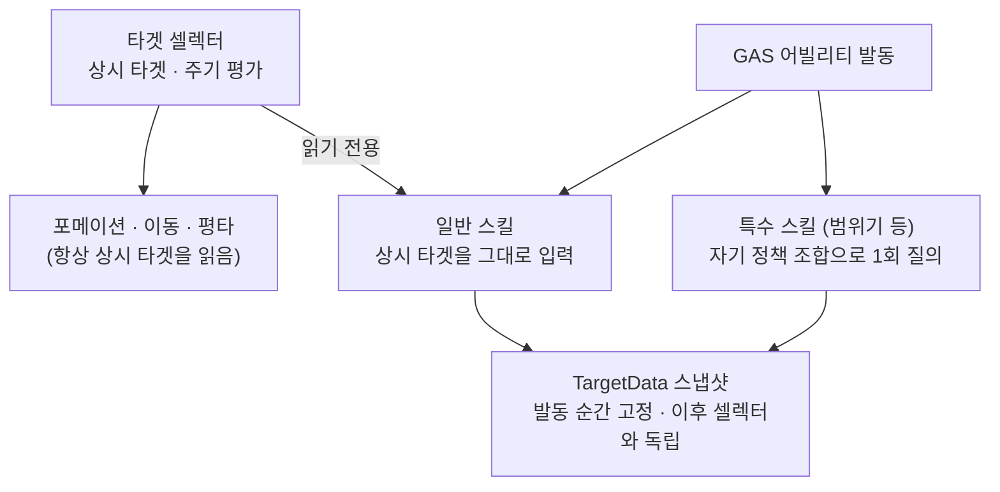

# ADR-0009: 가중치 조합 타겟 정책과 캐릭터별 셀렉터

> 작성 원칙 (README_ko와 동일): 압축해서 적으면 몇 주 뒤에 내가 못 읽는다. 변수명·내부
> 함수명 디테일은 적지 않는다 — "어느 클래스가 무슨 책임을 지는가"까지만.

- **결정일**: 2026-07
- **관련 코드 (길 찾기용 앵커)**:
    - `ITargetable` (`AI/Targeting/`) — 진영 중립의 타겟 계약 (자격 + 포위 반경)
    - `UTargetScorePolicy` + `_Nearest` / `_NearestLeader` / `_LeaderFocus` / `_AllyFocus`
      (`AI/Targeting/`) — 무상태 점수 정책
    - `UTargetSelectorComponent`(추상) + `UPartyTargetSelectorComponent` (`AI/Targeting/`)
      — 평가 루프의 주인 + 파티 측 재료 공급
    - `APartyManager` — 멤버 back-ref 주입, 리더 타겟 임시 브리지
- **선행 결정**:
    - ADR-0002 (교체 가능한 전략 객체 — 정책 프레임워크가 같은 패턴을 타겟팅에서 재사용)
    - ADR-0003 ("평가는 계속, 결정은 끈적" — 셀렉터의 시간 구조가 같은 계보)
    - ADR-0008 (인지 레이어 — 셀렉터의 후보 공급원)

---

## 1. 한 줄 요약

> 타겟 선정을 "0~1 점수를 내는 무상태 정책들의 가중치 조합"으로 만들고, 캐릭터마다
> 자기 조합·자기 재평가 주기를 갖게 한다. 선정 프레임워크는 진영을 모르며(측별 차이는
> 재료 공급 훅 두 개), 같은 정책·같은 조합 형식이 미래의 GAS 어빌리티 조준 질의에
> 그대로 재사용된다. **타겟 레이어는 선정만 하고 위치는 절대 정하지 않는다.**

---

## 2. 맥락 (왜 이 결정이 필요했나)

타겟 시스템의 설계 목표는 처음부터 다음 네 가지였다:

1. **정책 조합 = 캐릭터 개성.** "플레이어 타겟 우선", "가까운 적 우선", "뭉친 적 우선"
   같은 방침을 캐릭터가 골라 가중치로 섞는다. 개성이 코드 분기가 아니라 데이터 조합으로
   표현돼야 한다.
2. **전원 동시 전환 금지.** 파티원들이 같은 주기로 타겟을 갈아타면 "프로그램이 돌고
   있구나"가 화면에서 보인다. 재평가는 캐릭터 각자의 어긋난 박동이어야 한다.
3. **협공은 결과.** 포위 진형은 각자 선정한 타겟이 우연히 같았을 때 나오는 결과이지,
   파티원을 같은 목표에 고정하는 강제가 아니다. 협공 *성향*은 존재할 수 있으나 채용은
   캐릭터 특성이다.
4. **적 타겟팅이 임박.** 적도 곧 같은 방식으로 타겟을 고른다. 진영 지식이 평가 코어에
   스며들면 바로 다음 단계에서 뜯게 된다.

또 하나, 구조적 질문이 있었다: 타겟은 위치(내가 어디 있나)를 입력으로 쓰고, 위치
(포메이션)는 타겟을 입력으로 쓴다 — 순환처럼 보이는 이 관계를 어떻게 끊는가.

---

## 3. 결정과 그 이유

### 3.1. 타겟 계약 `ITargetable` — 진영 중립, 두 가지만 답한다

"무엇이 타겟이 될 수 있나"를 액터 통째 캐스트가 아니라 인터페이스 계약으로 만들었다.
계약은 둘뿐이다: **자격**(지금 잡을 수 있나 — 사망·무적·기믹 비활성은 타겟 자신이 답하고
셀렉터는 이유를 모른 채 결과만 필터)과 **공간 정보**(포위 반경 — 충돌과 별개의 연출 값).

- 구현 위치는 양 진영 공통 캐릭터 베이스다. "전투 타겟이 될 수 있다"는 아군·적의 공통
  성질이며, 적이 아군을 타겟팅할 때 이 계약 덕에 적 레이어가 파티 타입을 몰라도 된다
  (ADR-0008의 의존 방향 규칙이 타겟팅에서도 유지된다).
- BP 구현 가능하게 열어 두었다. 미래의 기믹 타겟은 BP-only 액터일 가능성이 높다.
- 이 계약은 "누가 적인가"에 답하지 않는다. 진영 구분은 후보 **공급 층**(인지)의 일이다 —
  파티 셀렉터의 후보는 파티 인지가 주고, 적 셀렉터의 후보는 적 그룹 인지가 준다.
  후보 풀이 상류에서 이미 큐레이션되므로, 셀렉터가 월드를 뒤지며 "너 타겟 가능해?"라고
  묻는 구조 자체가 없다.

### 3.2. 무상태 정책 + 가중치 조합

정책은 "컨텍스트와 후보 하나를 받아 0~1 점수를 반환"하는 계약 하나다. 캐릭터(의 셀렉터)는
`정책 + 가중치` 쌍의 배열을 들고 후보마다 가중 합산해 최고점을 고른다. 0~1 정규화는
가중치가 정책 간 비교 가능한 스케일이 되기 위한 계약이다.

**"무상태(stateless)"의 의미** — 정책 객체는 에디터에서 정하는 *설정값*(예: 점수 반감 거리)만 가질 수 있고, 
런타임에 갱신되는 *상태*(직전 타겟, 누적 타이머, 점수 캐시 같은)는 가질 수 없다. 
이유는 Instanced 객체의 수명 구조에 있다: BP 디테일 패널에서 편집하는 정책은 그 BP의 **템플릿에 사는 실물
객체**이고, 스폰된 캐릭터들은 그 템플릿을 기준으로 사본을 받는다. 복제기는 필드가
설정인지 상태인지 구분하지 못하므로, 상태 필드가 있으면 템플릿에 우연히 묻은 값
(PIE 중 편집, 에디터 유틸리티 실행 흔적 등)이 **모든 스폰의 초기 상태로 복제된다.**
크래시가 아니라 점수가 미묘하게 이상해지는, 최악의 부류의 조용한 버그가 된다.
상태가 필요하면 셀렉터 컴포넌트에 둔다 — 컴포넌트는 캐릭터당 하나가 구조적으로 보장된다.

정책 조합을 공유 DataAsset으로 뺄 계획은 없다. 진형 Preset을 기각한 ADR-0007과 같은
판단이다 — 정책 조합은 캐릭터 개성이라 재사용 축이 아니고, 편집 진입점은 각 캐릭터 BP다.

컨텍스트(평가에 쓰는 사실 스냅샷)의 성장 규칙도 함께 정했다: **필드는 현존 정책이
소비하는 것만 담는다.** 미래 정책을 상상해 필드를 미리 파두지 않는다 — 정책이 추가될 때
필드도 같이 오며, 그건 기존 정책 무수정으로 가능하다. 리더 의존 필드가 비어 있는
컨텍스트(적 측)에서 리더 의존 정책은 0점을 반환한다 — 진영 분기가 아니라 입력 부재에
의한 퇴화다.

### 3.3. 추상 셀렉터 + 진영 자식 — 측별 차이는 훅 두 개

평가 루프(주기, 커밋, 무효화 처리, 전환 로그)는 진영과 무관하다. 측별로 다른 것은 정확히
두 가지 — **컨텍스트 재료를 어디서 모으나**와 **후보를 어디서 받나** — 뿐이다. 그래서
추상 베이스가 루프를 소유하고, 진영 자식이 공급 훅 두 개만 구현한다. 파티 자식은 파티
허브에서 당겨오고, 적 자식(다음 단계)은 적 그룹의 인지 목록에서 당겨온다. Formation의
추상 베이스 + Follow/Battle 자식과 같은 배치다.

데이터 흐름은 **Pull**이다: 셀렉터가 평가하는 순간에 최신 사실을 당겨온다. 평가 타이밍의
소유권이 셀렉터에 남는 것이 핵심이다(아래 3.4의 어긋난 박동이 성립하려면 밀어넣는 쪽의
박동에 종속되면 안 된다). 유일한 Push는 타겟 소멸 통지(파괴 이벤트 구독)로, 타겟 교체
시 이전 타겟의 구독 해제가 유일한 stale 관리 지점이다.

캐릭터가 파티 허브를 아는 경로는 등록 시점의 back-ref 주입 하나다. 소속의 원본은 허브의
멤버 명부이고, back-ref는 그 원본에서 유도되는 값이다 — ADR-0008의 그룹 멤버 등록과
같은 규칙이며, 설정 경로가 하나뿐이라 원본과 어긋날 수 없다.

### 3.4. 어긋난 박동 — 주기는 개성, 위상은 강제 분산, 상실엔 반응 지연

- **재평가 주기는 캐릭터 성격 값이다.** 기민한 캐릭터는 짧게, 신중한 캐릭터는 길게 —
  주기 자체가 에디터에서 만지는 개성이 된다.
- **위상을 강제로 어긋낸다.** UE의 틱 간격 기능만 쓰면 전 컴포넌트가 같은 프레임에
  등록돼 위상이 정렬된 채 돈다. 그래서 델타 수동 누적 + 매 사이클 주기를 ±지터로
  재추첨하는 방식을 썼다. 같은 주기 값을 줘도 영구히 어긋나 있고 메트로놈처럼 규칙적이지도 않다.
- **타겟 상실(사망·자격 상실)은 주기를 기다리지 않는다** — 시체를 응시하는 쪽이 더
  기계적이다. 단, 즉시 재평가는 역으로 동기화 위험이 있다(공유 타겟이 죽으면 전원이
  같은 프레임에 갈아탄다). 그래서 랜덤 반응 지연을 한 번 끼운다 — "죽는 걸 보고 각자
  반응 시간이 다르다"는 사람다움이 설정값 하나로 나온다.
- 부수 효과: 평가가 어긋나 있으면 협공 성향 정책이 읽는 "동료들의 타겟"이 항상 남들의
  *커밋된* 값이다. 동시 평가 경합이 구조적으로 없다 (ADR-0003에서 점유 입력을 커밋
  슬롯으로 한정한 것과 같은 구도).

### 3.5. 교체 마진을 만들지 않았다 — 억제 대신 관측

"새 후보가 현재 타겟보다 확실히 좋을 때만 교체"하는 마진·최소 유지 시간을 검토했고,
**의도적으로 넣지 않았다.** 근접 정책이 이동 후 더 가까워진 적으로 갈아타는 것은 정책이
정확히 일하는 것이며, 난전 속에서 눈앞의 적을 그때그때 상대하는 역동성이다. 마진으로
누르면 오히려 한 놈만 우직하게 패는 구식 AI가 된다. "깨지는 동작만 막고, 거동은
연다"(ADR-0006)와 같은 판단이다. 대신 **전환 로그**(누가, 무엇→무엇, 사유)를 디버그
스위치 뒤에 두어, 층간 핑퐁(타겟 변경→포메이션 이동→최근접 변경→…)이 실제로 거슬리는
수준인지 실측으로 판단한다. 필요해지면 "현재 타겟 유지 보너스"를 *정책 하나*로 추가하면
되므로, 프레임워크 수정 없이 열리는 문이다.

타겟↔위치의 순환처럼 보이는 관계는 입력의 종류로 끊었다: 타겟 선정은 **사실**(현재 실제
위치)만 읽고, 위치 결정은 **결정**(선정된 타겟)을 읽는다. 한 프레임 안에서는
`사실 → 타겟 → 위치 → 이동`의 단방향이고, 순환은 프레임을 넘는 피드백일 뿐이다.
포메이션 쪽 커밋 슬롯 검증이 시간이 아니라 의미 조건("이 자리에서 현재 타겟을 때릴 수
있나")이라, 타겟이 바뀌면 스스로 무효화된다 — 두 층이 서로의 타이머를 참조하지 않고도
정합이 유지된다.

### 3.6. 상시 타겟과 순간 타겟 — GAS 어빌리티로의 재사용

타겟은 두 종류다. **상시 타겟**은 셀렉터의 지속 상태로 포메이션·이동·평타가 읽는다.
**순간 타겟**은 스킬 발동이라는 한 시점의 답이다. "범위기를 쓸 때만 밀집 우선"같은
요구는 셀렉터 가중치를 런타임에 조작하는 게 아니라(설정과 상태의 경계 붕괴),
**어빌리티가 자기 데이터에 자기 정책 조합을 들고 와 발동 순간 1회 질의**하는 형태로
푼다. 정책이 무상태 순수 함수라서 이 재사용이 공짜로 성립한다 — 같은 정책 클래스를
셀렉터는 주기적으로, 어빌리티는 일시적으로, 서로 간섭 없이 평가할 수 있다.

역방향은 기본적으로 없다: 어빌리티의 선택은 상시 타겟에 기록되지 않는다. 기록된다면
스킬 한 방이 포메이션 anchor를 끌고 가는 핑퐁을 구조에 내장하는 셈이다. 예외는 타겟
전환 자체가 기능인 스킬(락온류)뿐이며, 그때도 셀렉터의 커밋 경로를 경유한다.

이 절은 방향 결정이다 — 가중 합산부를 순수 질의 함수로 추출하는 작업은 GAS 단계에서
한다. 합산이 한 덩어리로 모여 있고 정책이 무상태라, 추출은 리팩토링이 아니라 이사다.

---

## 4. 기각한 대안

### 대안 A (타겟 계약): 구체 타입 캐스트 / GameplayTag / 부착 컴포넌트

- **구체 캐스트 유지**: 더미 삭제 시점에 캐스트 대상을 적 캐릭터로 바꾸는 건 커플링의
  청산이 아니라 이사다. 기믹 타겟이 로드맵에 있어 세 번째 구현체도 예고돼 있었다.
- **GameplayTag**: "타겟 가능"이라는 분류는 표현해도 포위 반경 같은 *데이터*를 나르지
  못한다. 데이터를 얻으려면 캐스트가 부활한다. 태그는 분류(직업 등)의 도구지 계약이 아니다.
- **부착 컴포넌트**: 임의 액터에 붙이는 유연함은 기믹 단계에서 매력적이지만, 지금
  도입하면 조회 비용(컴포넌트 검색)만 얹히고 구현체가 하나뿐이라 이득이 없다. 기믹
  단계에서 "인터페이스를 구현한 컴포넌트 보유 액터"로 확장 가능하므로 문은 닫히지 않는다.

### 대안 B (데이터 흐름): 허브가 컨텍스트를 만들어 밀어넣기 (Push)

허브가 공유 연산을 한 번만 해서 배포한다는 표면적 이점이 있으나, Push는 허브의 박동으로
일어나고 평가는 셀렉터의 지터 박동으로 일어난다. 스냅샷이 평가 시점까지 묵거나, 허브가
각 셀렉터의 스케줄을 알아야 한다 — 후자는 기각한 "중앙의 단일 박동"의 부활이다. 또한
허브가 캐릭터 내부의 특정 컴포넌트를 겨냥해 찌르는 것은 층위 침범이다(허브의 push가
허용되는 것은 캐릭터의 공개 API까지다). 공유 연산 1회라는 이점은 Pull에서도 소스 측
캐싱으로 동일하게 달성된다.

### 대안 C (허브 참조): 월드 스캔 / 수동 지정 / 서브시스템 / GameState / Owner 체인 / 태그·ID / 싱글턴

back-ref 주입 대신 검토한 계보를 남긴다. **월드 스캔**은 "허브는 하나"라는 가정이 박히고
(같은 골격을 적 무리에 재사용하는 순간 깨진다), 소속은 검색으로 발견하는 게 아니라 명부가
정하는 것이다. **디자이너 수동 지정**은 허브의 명부와 캐릭터의 참조라는 같은 사실이 두
곳에 생겨 어긋난다. **서브시스템 레지스트리**는 그 맵을 결국 허브가 채우므로 back-ref를
제3의 장소에 저장하는 것 + 간접 계층이다(허브를 모르는 임의 시스템이 소속을 물어야 할 때
다시 온다). **GameState 포인터**는 단일 가정 + 프레임워크 층의 커플링. **Owner 체인**은
넷 relevancy 의미가 실린 채널이라 의미 오염이고 적은 이미 스포너가 Owner다. **태그**는
해석 단계(태그→인스턴스)와 양쪽 동기화가 필요해 기각안들의 합성이 된다. **ID**는 발급자가
허브면 그게 곧 주입이며 해석 테이블만 추가된다 — ID가 이기는 조건(세이브, 리플리케이션,
스트리밍 late binding)이 이 프로젝트에 없고, 댕글링 방어는 약참조가 언어 수준에서 준다.
**싱글턴**은 "허브는 세상에 하나" 가정 위에서만 성립하고, UE에서 그 자리는 결국
서브시스템/GameState라 위 기각과 동일하다. 어떤 메커니즘이든 소속의 원본(허브의 명부)에서
파생시켜야 하며, 가장 짧은 파생 경로가 등록 시 약참조 주입이다.

### 대안 D (컨텍스트 성장): provider 지연 공급 / 요구 선언

컨텍스트가 비대해질 우려에 대해. **지연 공급**(컨텍스트에 데이터 대신 공급자를 넣고
정책이 콜백으로 당김)은 필요한 것만 계산되지만 정책의 순수성이 깨진다 — 입력 구조체만
보고 답한다는 성질이 템플릿 안전성과 임의 시점 질의(GAS 재사용)의 근거라, 이를 흐리는
비용이 크다. 기각. **요구 선언**(정책이 읽는 필드를 선언하고 셀렉터가 합집합만 수집)은
정책 순수성을 지키는 올바른 개선 경로지만, 현재 필드는 전부 포인터 몇 개 읽기 수준이라
기계장치가 절약하는 게 없다. **첫 고비용 필드**(후보 밀도 등)를 도입 트리거로 정하고 보류.

---

## 5. 결과 (얻는 것 / 치르는 것)

**얻는 것:**

- 캐릭터 개성이 코드가 아니라 BP의 정책 조합 × 가중치로 표현된다
- 정책 추가가 기존 코드 무수정으로 가능함을 실제로 확인했다 (LeaderFocus/AllyFocus
  추가 시 베이스 정책·셀렉터·평가 루프 무변경)
- 협공·포위가 강제가 아니라 점수 경향의 결과로 창발한다
- 전원 동시 전환이 구조적으로 일어나지 않는다
- 적 타겟팅은 공급 훅 두 개 구현으로 합류한다

**치르는 것 / 남은 작업:**

- 밀집 우선 정책은 어빌리티 질의 API와 함께 설계한다 (질의 형태가 정해져야 밀도 계산의
  지불 주체가 정해진다)
- 가중 합산부의 순수 질의 함수 추출은 GAS 단계의 작업이다
- Battle Formation이 아직 파티 단일 타겟만 소비한다. 리더의 선정 결과를 대표로 공급하는
  임시 브리지가 있으며, 개별 타겟 소비(타겟×역할 그룹핑)가 다음 Formation 작업이다
- 런타임 파티 합류가 생기면 그 합류 API가 back-ref 주입을 담당해야 한다 (현재는 시작 시 1회)

---

## 6. 기존 ADR과의 관계

- **ADR-0002**: "교체 가능한 전략 객체 + 데이터 선택"의 패턴을 타겟팅에서 재사용한다.
  OCP의 검증(추가가 수정이 아님)도 같은 방식으로 반복했다.
- **ADR-0003**: "평가는 계속, 결정은 끈적"의 시간 구조가 셀렉터에도 흐른다. 단 끈적함의
  구현이 다르다 — 포메이션은 커밋 게이트, 타겟은 (마진 없이) 어긋난 박동과 관측. 층이
  위일수록 끈적하고 아래일수록 기민한 시간 피라미드(인지 히스테리시스 > 모드 > 타겟 >
  포메이션 게이트)를 의도했다.
- **ADR-0007**: "재사용 Preset보다 지점별 직접 편집"의 철학이 정책의 DataAsset 비채택으로
  이어진다. 정책 조합은 캐릭터 개성이라 재사용 축이 아니다.
- **ADR-0008**: 셀렉터의 후보 공급원이 인지 레이어다. 진영 격리(적 레이어는 파티를
  모른다)는 0008의 의존 방향 규칙을 타겟 계약(`ITargetable`)이 이어받은 것이다.