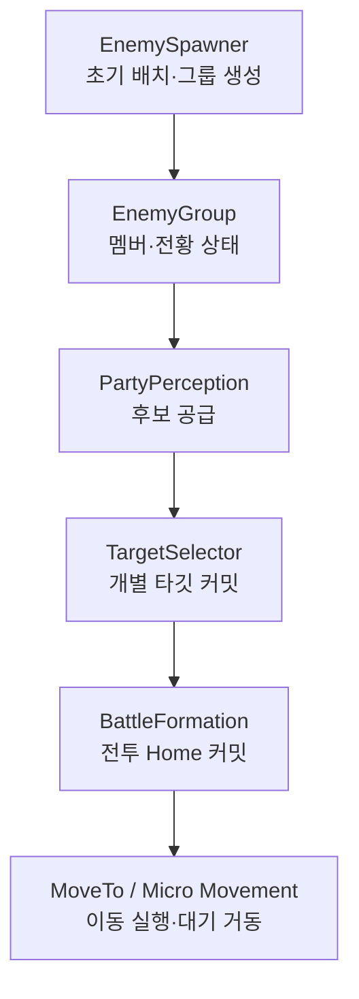

# 개인 로드맵 및 핵심 메모

> 개발을 이어갈 때 진행 상태, 설계 맥락, 시행착오와 아이디어를 복원하기 위한 한국어 내부 문서.
> 결정은 키워드만 남기지 않고, 무엇을 해결하려 했고 왜 그 방향을 선택했는지 문장으로 기록한다.
> 깊은 설계 근거는 [`Docs/ADR/ko/`](./Docs/ADR/ko/)에 두고, 여기서는 전체 흐름과 현재 우선순위를 함께 관리한다.

---

## 🎯 큰 그림

**프로젝트 목표**: 《Granblue Fantasy: Relink》와 《Arknights: Endfield》처럼 플레이어와 함께 이동하고 전투하는 3명의 온필드 동료 AI 구현.

**핵심 방향**:

1. 평시와 전투 상황에 따라 동료 AI의 행동 체계를 전환한다.
2. 전투에서는 아군과 적의 상황을 함께 고려해 각 AI의 타겟과 포메이션을 결정한다.
3. 보스의 전체 공격이나 기믹처럼 특정 전투에서 필요한 행동이 평시 AI 정책보다 높은 우선순위로 개입할 수 있게 설계한다.
4. 개발자가 구현한 AI 기능을 플래너·기획자 등 다른 직군이 게임 콘텐츠에 직접 적용할 수 있도록 간편화해서 협업을 중요시한다.
5. 로직의 재사용 가능성은 열어두되 클래스별 책임을 분리하고, 모든 클래스가 서로를 참조하는 구조는 피한다.
6. 아군의 전투 AI를 단순한 자동 전투 기능으로 끝내지 않고 플레이어의 재미로 연결할 방법을 기획하고 구현한다.

**현재 상태**:

> 평시 추종·환경 적응·Yield → 적 그룹 인지와 교전 상태 → 캐릭터별 가중치 기반 타깃 선정 → 개별 타깃 기준 전투 Home → Home 주변 미세 이동까지 구현.

다음 핵심 단계는 **동료 공격과 스킬(GAS), 동료별 행동 상태(StateTree), 적 그룹의 런타임 전투 진형**이다.

### 현재 데이터 흐름

- 인지는 “누가 후보인가”까지만 결정한다.
- 타깃 셀렉터는 “그중 누구를 상대할지”만 결정한다.
- 전투 진형은 “그 타깃 기준 어디를 Home으로 삼을지” 결정한다.
- AIController와 Character는 확정된 위치까지의 이동을 실행한다.
- 미세 이동은 Home과 타깃을 읽기만 하고 둘 다 수정하지 않는다.

---

## ✅ 완료한 것

### 평시 추종 진형

- Manager / Controller / Character 3레이어 책임 분리, 역할에 종속되지 않는 캐릭터 클래스
- V자 진형 추종과 벽 충돌 시 평면 슬라이딩
- `UFormationDataAsset` 기반 데이터 주도 진형 정의 — 코드 빌드 없이 진형 추가
- 환경 보정 파이프라인: 경사 높이 보정 → NavMesh 투영 → 벽 슬라이드 → 앵커 방향 복구
- 속도 기반 진형 간격 변화와 지연 회전
- 통로 폭에 따른 V자 ↔ I자 자동 전환과 히스테리시스
- 슬롯과 플레이어 사이의 오차를 기준으로 슬롯 캐시 갱신
- 경사면을 벽으로 오인하던 충돌 판정 수정

### Yield

- Yield 판단을 Character에서 진형 Component로 이동 — 공유 슬롯과 다른 동료 상태가 필요한 진형 단위 정책
- 반응 지연으로 동료 전원의 동시 반응 방지
- 플레이어 진행 방향을 고려한 후퇴 위치와 진입·이탈 히스테리시스
- Velocity가 아니라 Facing 기반 Cone 판정 — 카메라 방향과 캐릭터 방향이 분리되는 게임에서 의도 명확화
- `UYieldStrategy` 추상화와 Standard / None 구현
- `IYieldContextProvider`로 전략이 구체 Formation Component에 의존하지 않게 분리
- Yield 중 헝가리안 재배정 제외 — 양보 이동과 슬롯 재배정의 명령 충돌 방지

### 회피와 트래버설

- RVO에서 Detour Crowd로 전환 — 사후 반응식 회피보다 경로 예측과 그룹별 우선순위 사용
- Controller의 Possess를 회피 역할 설정의 단일 진입점으로 사용
- 플레이어를 Crowd에 포함하기 위한 `UPlayerCrowdAgentComponent`
- `UTacticalCrowdFollowingComponent`로 Leader / Normal / Yielding 회피 역할 구분
- Yield 상태와 Crowd 회피 역할 동기화
- 경로상의 상향 단차를 넘는 `UTacticalTraversalComponent`
- 벽 인지 → 도약점 계산 → 진입 조향 → 포물선 발사의 실행 흐름

### 적 스폰과 초기 배치

- `ByEnemyClass`와 `CompositeFormation` 두 스폰 구성 방식
- **Preset 검토 후 Spawner 인라인 조합으로 변경** — 처음에는 `Line + Line`, `Line + Circle` 같은 완성 진형을 DataAsset Preset으로 만들어 여러 스폰 지점에서 고르는 방향을 생각했다. 하지만 실제로 원한 것은 같은 배치의 재사용이 아니라, 지형과 몬스터 구성에 맞춰 **스폰 지점마다 다른 전열·후열을 그 자리에서 편집하는 것**이었다. Preset으로 가면 작은 차이마다 복제·Override·Variant·동기화 규칙이 따라오고, 실제 편집 대상이 Preset인지 Spawner인지 흐려진다. 그래서 `FEnemyCompositeFormation`을 `AEnemySpawner` 안에서 직접 편집하는 구조로 바꿨다.
- Line / Circle / Arc / Scatter 하위 진형 전략
- `EditInlineNew + Blueprintable`로 C++ 재빌드 없이 새 배치 전략 추가 가능
- **이상 위치와 월드 보정 분리** — 처음에는 각 하위 진형이 자기 슬롯의 벽·NavMesh 보정까지 책임지는 방식도 가능해 보였다. 그러나 그러면 모든 진형이 같은 충돌 보정을 중복하고, 단순한 배치 알고리즘이 Navigation과 월드 충돌까지 알아야 한다. 하위 진형은 이상적인 슬롯만 생성하고, 실제 스폰 가능 위치 보정은 Spawner 한 곳에서 공통 처리하도록 잘랐다.
- 안전한 위치를 찾지 못하면 벽 안에 강제로 스폰하지 않고 해당 적 생성을 포기
- `CallInEditor` 프리뷰를 일시 오브젝트로 생성해 레벨 저장 상태를 오염시키지 않음
- 스폰 시 `AEnemyGroup` 생성과 멤버 등록. Spawner는 생성 후 런타임 그룹 운영에서 빠짐

### 적 그룹 인지와 교전 상태

- **스폰 후 사라지던 그룹을 런타임 객체로 승격** — 초기 배치는 그룹 단위였지만 스폰이 끝난 뒤에는 그 무리를 대표하는 실체가 없었다. 앞으로 필요한 전멸 판정, 전황 상태, 그룹 전술과 StateTree의 주인이 필요해 `AEnemyGroup`을 만들고 멤버 명부와 `Idle / Alert / Engaged / Return` 상태를 한 곳에 모았다.
- **Spawner가 아니라 `AEnemyGroup`이 운영 주체** — 스폰 목록을 이미 아는 Spawner에 그룹 AI까지 붙이면 구현은 짧지만, 생성과 전투 지휘가 한 클래스에 섞이고 그룹 수명도 Spawner에 묶인다. Spawner는 그룹을 만들고 멤버를 등록한 뒤 손을 떼며, 이후 운영은 그룹이 맡는다.
- **`UObject`나 Subsystem 대신 `AInfo`** — 그룹은 렌더링·충돌은 필요 없지만 자기 생명주기, 저주기 감지, 상태 전이, 이벤트와 향후 `UStateTreeComponent`의 부착 대상이 필요하다. 그래서 렌더링 없는 정보 Actor인 `AInfo`를 선택했다.
- 저주기 거리 감지와 피격 통지를 그룹 상태 전이의 두 진입 경로로 제한
- **공유 Encounter 상태를 만들지 않음** — 파티는 이탈했지만 적은 추격 중이거나, 파티만 적을 발견한 상태를 기본적으로 표현하고 싶었다. 파티 인지와 적 그룹 상태를 하나로 합치면 이런 장면마다 보조 플래그가 필요해진다. 두 상태를 독립시키고 측을 건너는 것은 피격 같은 이벤트뿐으로 제한했다.
- 파티가 그룹을 인지해도 적 그룹에는 아무것도 쓰지 않는다. 이 읽기 전용 의존 덕분에 “아군은 인지했지만 적은 아직 모른다”는 비대칭이 별도 예외 없이 나온다.
- 파티는 리더 위치를 기준으로 적 그룹을 인지하며, 한 멤버가 감지되면 그룹 전체를 후보군으로 승격
- 적 그룹은 Engaged 동안 알려진 아군 목록을 제공
- 그룹과 타깃 참조는 약참조와 유효성 필터로 Actor 소멸에 대응

### 캐릭터별 타깃 선정

- 진영 공통 `UTargetSelectorComponent`가 평가 루프, 점수 합산, 타깃 교체와 수명 처리를 담당
- `UPartyTargetSelectorComponent`와 `UEnemyTargetSelectorComponent`는 컨텍스트와 후보 공급만 담당
- `Nearest`, `NearestLeader`, `LeaderFocus`, `AllyFocus` 정책 구현
- **중앙 배분기 대신 정책 조합** — 중앙에서 “이 동료는 저 적”을 지정하면 결과는 통제하기 쉽지만, 새 전투 성향이 생길 때마다 중앙 분기가 커진다. 각 캐릭터가 같은 후보를 보고 무상태 정책의 점수를 가중 합산하도록 해, 협공과 분산이 명령형 배분이 아니라 캐릭터별 정책 조합의 결과로 나오게 했다.
- 정책 반환값을 공통 범위로 정규화하고, `EditInlineNew` 정책 객체와 가중치를 캐릭터 Blueprint에서 조합
- 평가 주기 지터와 타깃 상실 반응 지연으로 기계적인 동시 전환 방지
- **교체 마진 없이 먼저 열어두고 실측** — 처음에는 가까운 적이 바뀌면 바로 갈아타는 역동성을 살리기 위해 점수 마진과 최소 유지 시간을 넣지 않았다. 실제 난전에서 점수의 작은 출렁임이 타깃 진동으로 보이자 억제가 필요하다는 판단이 생겼다.
- **점수 문턱 대신 정책별 Hold** — 점수 차에 마진을 두면 정책 조합과 곡선마다 문턱의 의미가 달라진다. 대신 “이 정책이 주도한 결정을 얼마나 오래 신뢰할 것인가”를 정책이 선언하게 했다. 승리 후보에 가장 크게 기여한 정책의 `HoldDuration`을 적용하고, 타깃 소멸·자격 상실만 즉시 홀드를 해제한다.
- **사람이 흔드는 값을 점수 크기에 직접 넣지 않음** — 후보와 리더의 거리를 계속 점수화했을 때 플레이어가 적 사이를 오가는 것만으로 순위가 뒤집혔다. 자기와 리더 사이의 이탈 정도로 정책 전체의 기여도를 점진적으로 켜는 복귀 성향으로 바꿨다.
- **정책은 무상태** — Instanced 정책의 런타임 상태가 Blueprint 템플릿에 남으면 모든 스폰의 초기값으로 복제되는 조용한 버그가 된다. 타이머와 현재 타깃은 캐릭터마다 하나인 Selector Component가 소유하고, 정책은 설정값과 점수 계산만 가진다.
- 타깃 참조는 `TWeakObjectPtr`, 파괴 이벤트는 생명주기에 맞춰 등록·해제

### 개별 타깃 기반 전투 진형

- 동료마다 자신의 Target Selector가 커밋한 타깃을 사용
- `CombatRole`로 역할별 슬롯 생성 전략과 배치 우선순위 선택
- **Arc 폐기 → Encircle** — 근접 동료들이 같은 타깃을 잡을 때 Arc는 인원 수만큼 호를 나눴다. 개별 타깃을 붙이자 `한 명이 Nearest 재평가로 타깃 변경 → 기존 그룹의 인원 수 변경 → 남은 동료들의 호 재분할과 이동 → 실제 위치가 달라져 그들의 Nearest도 변경`되는 층간 진동이 생겼다. 적의 Facing을 호의 축으로 사용해 적이 회전할 때 전원이 안무처럼 따라 도는 문제도 있었다.
- **접근 방향 기반 개별형으로 변경** — Encircle은 “현재 내가 타깃의 어느 쪽에서 접근하고 있는가”를 기본 각도로 사용하고, 그 링에 이미 커밋한 동료와 최소 간격이 충돌할 때 새로 들어오는 자신만 필요한 만큼 비킨다. 인원 수와 적의 Facing에 대한 의존을 제거해 한 동료의 타깃 변경이 나머지 동료의 재배치로 전파되지 않게 했다.
- 모든 전투 슬롯 전략을 `1명 → 1슬롯` 계약으로 통일. 역할은 Strategy를 선택하지만 Strategy가 특정 직업에 귀속되지는 않음
- 원거리 `RangedSafe`: 타깃 주변 360도 후보를 사거리, 위협, 점유, 리더 방향 응집으로 평가
- **근접도 커밋 게이트에 합류** — 예전에는 Arc가 타깃을 매 Tick 추종하는 것이 의도라고 보고 원거리만 게이트를 사용했다. 하지만 그 추종이 타깃 레이어와 진동을 만든다는 사실이 확인돼, 근접도 사거리 이탈 등 기존 Home의 유효성이 깨질 때만 다시 커밋하도록 바꿨다.
- **영향맵의 역할 복구** — RangedSafe를 매 Tick 계산해 목적지로 밀었을 때 이동 중 현재 위치를 다시 고르며 멈추고, 플레이어가 적 주위를 돌면 후보 기준이 회전해 정지한 동료까지 튕겼다. 영향맵은 “지금 어디가 좋은가”를 답하는 평가기로만 두고, 커밋 게이트가 필요할 때 한 번 호출하도록 결정과 실행을 분리했다.
- 생성 전략이 `ShouldReposition`도 소유 — 자신이 만든 슬롯의 유효성 규칙을 같은 책임에 배치
- 다른 동료의 실시간 위치가 아니라 커밋 슬롯을 점유 기준으로 사용해 이동 중 노이즈 차단
- 슬롯 생성 후 NavMesh·경사·벽 보정을 공통 적용하고 Character의 이동 실행으로 전달

### Home 주변 전투 미세 이동

- **고정 슬롯이 아니라 Home** — 공격·회피·재배치가 생길 때마다 Formation에 예외 조건을 추가하지 않기 위해, 전투 슬롯을 반드시 지켜야 할 좌표가 아니라 다른 행동이 없을 때 돌아갈 기준점으로 정의했다.
- `IHomeSlotProvider`로 미세 이동이 `UFormationBattleComponent` 구체 타입에 의존하지 않게 분리
- Home과 현재 타깃을 읽기만 하는 소비자 구조
- **별도 이동 중재기 없이 충돌을 막은 현재 해법** — 미세 이동은 `AddMovementInput`을 쓰지만, PathFollowing이 Idle이 아니면 즉시 멈춘다. 추종·재배치·트래버설 어느 쪽도 미세 이동을 알 필요 없이 기존 MoveTo가 항상 이긴다. 이후 Movement Intent가 들어오면 이 규칙을 낮은 우선순위의 대기 이동으로 옮긴다.
- Home 안에서는 타깃 기준 좌우 사선 이동, 밖에서는 Home 복귀 성분을 포함한 방향 선택
- 이동과 대기 시간을 멤버마다 어긋나게 하고, 전투 대기 중에는 타깃을 계속 주시
- 한 번 시작한 짧은 이동은 완주해 잔걸음 반복 방지
- 공격 시스템에서 일시 정지할 수 있는 `SetSuppressed` 연결점 준비

### 프로젝트 운영과 문서

- ADR-0000 아키텍처 개관과 ADR-0001~0009 설계 기록
- 한국어판: 구현을 다시 이어가기 위한 상세 근거와 기각 대안
- 일본어판: 코드 세부를 줄이고 설계 방향을 설명하는 문서
- ADR은 결정을 동결하는 문서가 아니라, 변경 당시의 문제와 근거를 보존하는 문서로 운용
- 구현하지 않은 기능을 완료된 것처럼 쓰지 않고, 계획과 현재 코드를 명시적으로 구분

---

## 🚧 진행 중 / 바로 다음

- [ ] **Formation 초기 활성화 계약 수정** — `CurrentFormationMode`가 처음부터 Follow인데 `BeginPlay`에서 다시 Follow로 전환해 멱등 가드에 걸린다. 현재 기본 활성화 상태에 기대어 증상이 가려질 수 있으므로, 초기 미결정 상태를 두거나 실제 Component 활성 상태까지 확인해 첫 전환이 반드시 실행되게 한다.
- [ ] **Battle 전환 시 Yield 회피 역할 복원** — Follow Component가 비활성화될 때 Yielding이던 동료의 Crowd 역할을 Normal로 되돌리는 종료 처리가 없다. 모드 전환 뒤 이전 상태가 남지 않도록 `Deactivate` 경계에서 정리한다.

---

## 🎯 다음 작업 목표 (순서대로)

### 1. 아군 공격 — GAS + StateTree 도입

- 동료가 전투 Home을 기준으로 타깃을 공격한다. 공격 실행은 GAS Ability가 맡고, 캐릭터가 지금 어떤 행동을 하는지는 StateTree가 관리한다.
- 이미 준비한 연결점이 있다. 미세 이동의 `SetSuppressed`는 공격 중 대기 이동을 멈출 수 있고, Selector의 무상태 정책은 Ability 발동 시점에 한 번 질의하는 형태로 재사용할 수 있다(ADR-0009 §3.6). 슬롯 Strategy가 캐릭터 타입이 아니라 사거리를 입력받는 구조에는 스킬 사거리를 그대로 넣을 수 있다.
- ⚠️ GAS와 StateTree 모두 아직 개념이 얕다. **배워가며 진행하고, 확인하지 않은 지식으로 설계를 먼저 굳히지 않는다.** 개관 문서에 적어둔 것처럼 StateTree가 `MoveTo`를 직접 호출하지 않고 이동 Intent만 제출하는 경계를 실제 구현에서도 지킬 수 있는지가 검증 기준이다.

### 2. 적 그룹의 런타임 진형 전투

- 현재 적 진형은 스폰 시 초기 배치만 결정하며, **전투 중 진형을 유지하는 개념은 아직 없다.** 이 런타임 진형의 주인이 될 자리가 `AEnemyGroup`이다.
- 목표는 전열 방패와 후열 원거리처럼 역할에 따른 진형을 전투 중에도 유지하는 것이다. 다만 적을 슬롯에 못 박아 기계적으로 움직이게 하지 않고, 동료의 미세 이동처럼 **각자 자신의 슬롯 안에서 어느 정도 자유롭게 행동하게 한다.** 동료 쪽의 “Home은 수렴할 기준점이지 반드시 고정될 좌표가 아니다”라는 관점을 적에게도 적용한다.
- 구현 순서는 **아군 공격 → StateTree 검증 → 적 그룹 런타임 진형**이다. 그룹 전략은 slot / target / posture에 관한 Intent만 만들고 GAS Ability를 직접 실행하지 않는다(ADR-0006).

### 3. 동료 AI 전투를 플레이어의 재미로 연결하기 — 기획 숙제

- 《Arknights: Endfield》는 플레이어가 동료 스킬을 시전하면 동료가 플레이어의 타깃 옆으로 순간이동해 공격한다. 상태 스택을 중첩하는 스킬 연계로 동료를 제어하는 감각을 주지만, 연계 효율 때문에 파티 조합이 사실상 강제될 수 있다.
- 《Granblue Fantasy: Relink》는 동료 전투가 완전 자동이다. 강제되는 연계가 없는 대신 좋아하는 캐릭터를 자유롭게 조합할 수 있다.
- 내가 만들고 싶은 방향에서는 순간이동이나 플레이어가 동료의 스킬을 대신 사용하는 방식을 채택하지 않는다. 그렇다고 완전 자동 전투로 두려는 것도 아니다. **플레이어의 행동에 동료가 반응하면서도 캐릭터 선택을 과도하게 강제하지 않는 연계 지점**을 찾고 있다. 프로그래밍보다 기획에 가까운 문제이며, 1번과 2번의 전투 구조가 갖춰져야 실제 플레이로 실험할 수 있다.

### 4. 보스전 — 평시 정책을 상회하는 우선순위 구조

- 보스의 전체 공격 때 안전지대로 피하거나, 여러 기믹 대상이 나타났을 때 동료마다 하나씩 배정해 접근시키는 행동처럼 **평시의 타깃 선정과 Home 정책보다 높은 우선순위로 개입해야 하는 전투 이벤트**가 있다.
- 이를 위해 개관 문서에서 Movement Intent를 생존부터 Home까지 우선순위로 나누고, 파티 단위 Coordinator가 여러 동료의 목적지를 함께 배정하는 구조를 구상했다. 개별 StateTree가 각자 안전 위치를 고르면 같은 곳에 몰릴 수 있기 때문이다. 실제 구현은 1번에서 GAS와 StateTree의 책임 경계를 확인한 뒤 진행한다.

### 큰 시스템의 예정 역할

| 시스템 | 담당할 범위 | 담당하지 않을 범위 |
| --- | --- | --- |
| GAS | 공격 실행, 비용·쿨다운, Gameplay Tag, 중단·종료, 효과 적용 | 타깃 선정과 전술 위치 결정 |
| StateTree | Idle / Approach / Attack / Recover 같은 지속 상태와 전이 | 매 Tick 후보 채점과 NavMesh 위치 보정 |
| Formation | 역할과 타깃 기준 Home 결정, 재배치 조건 | Ability 직접 실행 |
| Movement Intent | 추종·Home·공격·회피·트래버설 이동 요구의 우선순위와 중단 가능성 해석 | 각 시스템의 세부 위치 생성 알고리즘 |

---

## 🗺️ 전체 로드맵

> 모든 항목을 반드시 구현한다는 의미가 아니다. 같은 고민을 반복하지 않도록 전체 선택지를 보존하고, 현재 목표에 맞춰 우선순위를 다시 정한다.

### 🟢 기능 설계

- **내려가는 트래버설** — 올라가기는 점프, 내려가기는 Walk-off-ledge가 자연스러운지 실측 필요
- **평지 Gap 점프 판정** — 높이 차이가 아니라 NavMesh 우회량이나 경로 단절을 신호로 사용할지 검토
- `SlotCacheUpdateDistance`를 FormationDataAsset으로 이동해 진형별 튜닝 허용
- Yield 중 플레이어의 추가 접근에 대한 재평가
- 리더 교체 실제 구현 — Possess 관련 진입점은 준비됨
- Traversal 중단 코드의 캐릭터 타입 가정 제거
- Occupancy 감쇠 곡선 개선 — 현재 배치가 격자처럼 읽힐 때 실측 후 변경
- 스폰 위치 보정 시 앞서 확정한 슬롯을 다음 슬롯의 충돌 판단에 반영
- V/I 자동 전환의 통로 측정을 리더 위치가 아니라 실제 진형 점유 공간 기준으로 정밀화

### 🟡 핵심 구조

- **동료 StateTree** — 전투 행동의 지속 상태와 명시적 전이를 담당. Formation과 Targeting 세부 계산은 C++ 유지
- **GAS 전투 행동** — 평타·스킬·피격·사망·타깃 불가 상태 연결
- **Movement Intent 조정 레이어** — 여러 이동 요구를 우선순위와 중단 가능성으로 조정
- **Home 주변 국소 이동 개선** — 현재 랜덤 미세 이동을 실측한 뒤 NavMesh 경계와 전술적 방향성을 포함할지 결정
- **CommitTime 정밀화** — 출발 시점과 도착 시점 중 어떤 시간이 재배치 거부감의 기준이어야 하는지 이동 거리 변화가 생긴 뒤 검증
- **Boss Evade Coordinator** — 개별 StateTree가 같은 안전지점에 몰리지 않도록 파티 단위 안전 위치 할당
- **적 그룹 런타임 전투** — 그룹이 슬롯·타깃·전열/후열 의도를 만들고 개별 적의 Ability를 직접 실행하지 않는 경계 유지
- **적 진형 이동** — 그룹 슬롯을 기계적으로 고정하지 않고 각 슬롯 안에서 제한된 자유 이동 허용
- **플레이어 개입 축** — 집중 공격, 우선 타깃, 스킬 연계 등 자율 AI를 플레이 경험으로 바꾸는 최소 명령 체계 검토

<strong>추가 목표와 낮은 우선순위</strong>

### 추가 목표

- 엄폐와 Line of Sight 평가
- 스킬 체이닝
- 통로용 Yield 전략
- NavLink를 인식하는 트래버설

### 낮은 우선순위

- NavMesh 가장자리 회피
- 플레이어의 물리 Push로 동료가 절벽 밖으로 밀리는 문제
- 현재 프로젝트 규모에서 필요하지 않은 대규모 AI 인덱싱·공간 분할 고도화

---

## 🧠 핵심 설계 결정

1. `APartyManager`를 독립 Actor로 두고 시스템 수명을 특정 캐릭터에 묶지 않는다.
2. Yield는 캐릭터별 반응이 아니라 공유 컨텍스트를 보는 진형 단위 정책이다.
3. Strategy는 런타임 상태를 갖지 않고 계산만 수행한다. 상태와 타이머는 Component가 소유한다.
4. 파티 인지와 적 그룹 교전 상태는 서로를 직접 구동하지 않는 별도 사실이다.
5. 중앙 타깃 배분기 대신 캐릭터별 가중치 정책으로 협공과 분산을 만든다.
6. 전투 위치는 강제 고정 슬롯이 아니라 다른 행동이 없을 때 돌아갈 Home이다.
7. “언제 옮길지”와 “어디로 옮길지”를 분리하고 결정 사이에는 슬롯을 커밋한다.
8. 원거리 배치는 전방 축을 먼저 정하지 않고 360도 후보를 독립 점수축으로 평가한다.
9. 스폰 시 그룹 경계는 런타임 거리 추론이 아니라 디자이너가 배치 데이터로 명시한다.
10. 적의 복합 초기 배치는 재사용 Preset보다 Spawner 안에서의 직접 조합을 우선한다.
11. 하위 진형은 이상 위치만 생성하고 NavMesh·충돌 보정은 Spawner가 공통 소유한다.
12. 미세 이동은 Home과 타깃을 읽기만 하며, 기존 MoveTo가 항상 우선한다.
13. StateTree는 지속 상태와 전이에 사용하고, 슬롯 계산·타깃 점수·NavMesh 보정까지 옮기지 않는다.

### 1. 왜 독립 `APartyManager`인가

파티 전체의 멤버와 모드를 특정 캐릭터의 Component가 소유하면 리더 사망이나 교체가 시스템 수명과 연결된다. `APartyManager`가 멤버와 모드의 유일한 소유자가 되고 Formation Component들은 활성 모드 안의 행동만 담당하도록 분리했다. 리더 교체를 시스템 재생성이 아니라 상태 변경으로 남기기 위한 선택이다.

### 2. 왜 인지와 교전을 분리했는가

처음에는 파티와 적 그룹의 교전을 공유 `Encounter` 객체 하나로 묶는 방식도 생각했다. 양쪽의 상태를 한곳에서 보면 편해 보이지만, 만들고 싶은 장면은 본래 비대칭이다. 파티는 적을 알아챘지만 적은 아직 모를 수 있고, 파티는 전투에서 이탈했지만 적은 계속 추격할 수도 있다. 공유 상태 하나로 묶으면 이런 장면마다 예외 상태가 필요해진다.

그래서 **파티가 어떤 적 그룹을 알고 있다는 사실**과 **적 그룹이 파티와 교전 중이라는 사실**을 별도로 두었다. 파티는 `AEnemyGroup`을 읽기만 하고 상태를 쓰지 않으며, 양쪽을 연결해야 할 때는 피격 같은 사건만 전달한다. 비대칭을 예외 처리로 만드는 대신 두 상태 머신의 독립성에서 자연스럽게 나오게 한 선택이다.

적 그룹은 스폰 뒤에도 멤버 명부, 그룹 상태, 전멸 판정과 향후 그룹 전술을 소유해야 한다. `Spawner`가 이것까지 계속 맡으면 생성자와 운영자가 결합한다. `Spawner`는 그룹을 만들고 멤버를 등록한 뒤 빠지고, `AEnemyGroup`이 런타임 주체가 된다. 렌더링·충돌은 필요 없지만 월드 수명, 저주기 감지, 이벤트와 향후 StateTree의 숙주가 필요해서 `UObject + Subsystem`이 아니라 `AInfo`를 택했다.

→ [ADR-0006](./Docs/ADR/ko/0006-enemy_group_combat_architecture.ko.MD)  
→ [ADR-0008](./Docs/ADR/ko/0008-group_perception_engagement_separation.ko.MD)

### 3. 왜 중앙 타깃 배분기가 아닌가

중앙 코디네이터가 동료별 타깃을 직접 지정하면 결과는 통제하기 쉽지만, 전투 성향과 새 판단 축이 늘 때 중앙 분기가 계속 커진다. 각 캐릭터가 같은 후보를 보되 여러 점수 정책의 가중 합으로 자기 타깃을 결정하게 했다.

협공은 `AllyFocus`, 플레이어 의도 추종은 `LeaderFocus`, 파티 복귀는 `NearestLeader`처럼 독립된 이유로 표현된다. 새 판단 축은 기존 셀렉터를 수정하지 않고 정책 하나로 추가할 수 있다. 다만 보스 기믹처럼 파티 전체에 유일한 배정이 필요한 문제는 별도의 Coordinator 책임으로 남긴다.

초기에는 반응성을 먼저 확인하려고 교체 마진이나 최소 유지 시간을 일부러 넣지 않았다. 실제로 돌려보니 점수의 작은 출렁임이 타깃 진동으로 바로 드러났다. 여기서 점수 차이 마진을 넣지 않고, **결정을 주도한 정책이 그 결정을 얼마 동안 신뢰할지 선언하는 Hold 시간**을 넣었다. 점수 차이의 의미는 정책과 곡선마다 달라지지만 시간은 전환 빈도에 직접 상한을 걸기 때문이다. Hold와 평가 타이머는 따로 흘려, 같은 시점에 Hold를 시작한 동료들의 재평가 박동이 다시 모이지 않게 했다. 타깃 소멸처럼 현재 결정이 성립하지 않는 경우만 즉시 Hold를 깬다.

`NearestLeader`도 처음에는 후보와 플레이어 사이 거리를 계속 점수에 넣었다. 하지만 플레이어 위치는 사람이 흔드는 고속 입력이라 적 사이를 오가기만 해도 순위가 뒤집혔다. 지금은 **자신이 리더에게서 얼마나 이탈했는지**로 해당 정책 전체의 영향력을 켠다. 플레이어 위치를 없앤 것이 아니라, 상시 순위 변수가 아니라 복귀 성향의 게이트로 바꾼 것이다.

점수 정책은 `EditInlineNew` 객체지만 런타임 상태를 갖지 않는다. Blueprint 템플릿에 사는 객체에 상태가 묻으면 그 값이 스폰 사본 전체로 복제되어 조용한 버그가 생길 수 있다. 타이머와 현재 타깃은 캐릭터마다 하나인 Selector Component가 소유하고, 정책은 같은 입력에 같은 점수만 반환한다.

→ [ADR-0009](./Docs/ADR/ko/0009-weighted_target_policy_selector.ko.MD)

### 4. 왜 전투 위치를 Home으로 보는가

전투 중 최종 위치는 공격, 회피, 재배치와 대기 이동이 함께 만든다. 슬롯을 반드시 서 있어야 하는 좌표로 정의하면 Formation 코드에 공격 중 예외와 회피 중 예외가 계속 추가된다.

슬롯은 다른 행동이 없을 때 돌아갈 Home으로 유지한다. 공격과 회피는 Home을 삭제하지 않고 일시적으로 우선한다. 현재 미세 이동도 Home을 읽기만 하며, 이후 GAS와 Movement Intent가 추가돼도 복귀 기준은 남는다.

→ [ADR-0000](./Docs/ADR/ko/0000-architecture_overview.ko.MD)

### 5. 왜 영향맵을 매 Tick 이동 명령으로 사용하지 않는가

처음에는 RangedSafe 영향맵을 매 Tick 평가해 최고점 위치로 계속 이동시켰다. 두 문제가 바로 생겼다.

- 이동 중인 동료가 다음 평가에서 현재 위치와 가까운 후보를 다시 뽑아 목적지까지 가지 않고 중간에 멈췄다.
- 플레이어를 기준으로 후보 방향축이 계속 회전해, 가만히 있어도 원거리 동료가 플레이어 궤도를 따라 자리를 조금씩 바꿨다.

영향맵의 품질 문제가 아니라 **좋은 위치를 찾는 평가기가 매 프레임 이동 컨트롤러 역할까지 한 것**이 원인이었다. 그래서 영향맵은 재배치가 필요한 순간에만 한 번 묻는 평가기로 내리고, 커밋 게이트가 현재 목적지를 버릴 조건만 판단하게 했다. 유효성 검사도 이동 중인 현재 위치가 아니라 이미 결정한 목적지를 기준으로 한다. 플레이어 위치는 점수에는 쓸 수 있어도 재배치 트리거에는 넣지 않는다.

이 과정에서 `Activate`를 반복 호출 가능한 갱신 함수처럼 취급해 커밋을 계속 초기화하는 문제도 겪었다. 안쪽에 방어 코드를 더하는 대신, `Activate`는 모드 진입 이벤트라는 함수 계약을 확인하고 호출부를 멱등하게 고쳤다. 이때부터 **증상이 아니라 함수 계약을 먼저 본다**는 원칙이 생겼다.

→ [ADR-0003](./Docs/ADR/ko/0003-battleformation_decision_execution_split.ko.MD)

### 6. 왜 원거리 후보를 360도로 만드는가

원거리 캐릭터가 한쪽에 뭉치는 문제를 보고 처음에는 타깃 둘레를 인원수만큼 Sector로 나눠 맡기려 했다. 뭉침은 줄지만 결과가 항상 최대 분산으로 기울고, 인원이 바뀔 때마다 Sector 경계와 담당 구역도 다시 바뀐다. 해결해야 할 것은 분산량이 아니라 **후보를 만들기 전에 전방 방향축을 정해 버린 구조**였다.

전방 방향을 먼저 정하고 좁은 부채꼴에 후보를 만들면 측면과 후방은 평가조차 할 수 없다. 플레이어나 적을 축으로 삼아도 입력이 움직일 때 후보 집합 전체가 회전한다.

타깃 주변 360도에 동일한 후보를 만들고, 사거리·위협·점유·응집 점수가 결과를 결정하게 했다. 후보 생성은 가능한 공간만 제공하고 전술적 선호는 평가에 위임한다.

→ [ADR-0004](./Docs/ADR/ko/0004-rangedsafe_omnidirectional_influence_map.ko.MD)

### 7. 왜 모든 전투 전략을 `1명 → 1슬롯`으로 통일했는가

근접 진형의 첫 버전인 Arc는 같은 타깃을 잡은 인원 수 `N`으로 호를 나눠 모두에게 다시 배정했다. 캐릭터별 타깃 선정을 붙인 뒤 다음 진동이 생겼다.

> 한 명의 `Nearest` 결과가 바뀜 → 기존 타깃의 `N`이 바뀜 → 남은 동료 전원이 Arc에서 재배치됨 → 이동한 동료들의 거리 점수가 바뀜 → 다른 동료의 타깃도 다시 바뀜

타깃 층의 한 결정이 위치 층 전체를 흔들고, 그 이동이 다시 타깃 점수로 돌아오는 **층간 피드백 루프**였다. Arc가 적의 Facing을 기준으로 돌아가서, 적이 방향만 바꿔도 동료 전원이 안무처럼 함께 회전하는 문제도 있었다.

그래서 Arc를 폐기하고 `Encircle`을 만들었다. 각 멤버는 **자기가 타깃에 접근하던 방향**을 기본 각도로 삼고, 이미 커밋된 동료와 최소 각도가 겹칠 때 새로 들어온 멤버만 필요한 만큼 옮긴다. 기존 자리의 동료는 다른 사람의 진입 때문에 움직이지 않는다. 인원 수와 적의 시선 방향에 대한 의존을 없애 타깃 변경의 영향 범위를 해당 멤버로 제한했다.

이 문제 뒤로 원거리뿐 아니라 근접도 같은 커밋 게이트를 사용하고, 모든 전략 계약을 `1명 → 1슬롯`으로 통일했다. 역할은 전략을 선택하지만 전략이 특정 직업에 귀속되지는 않는다.

→ [ADR-0002](./Docs/ADR/ko/0002-slot_generation_abstraction.ko.MD)  
→ [ADR-0003 2026-08 개정](./Docs/ADR/ko/0003-battleformation_decision_execution_split.ko.MD)

### 8. 왜 스폰 배치를 Preset으로 만들지 않았는가

처음에는 `Line + Line`, `Circle + Scatter` 같은 완성 배치를 DataAsset Preset으로 만들려 했다. 동일한 구성을 여러 스폰 지점에서 반복한다면 맞는 선택이다. 하지만 실제로 필요한 것은 **같은 스폰 구조의 재사용보다, 맵과 몬스터 구성에 맞춰 스폰 지점마다 다른 장면을 빠르게 만드는 것**이었다.

Preset으로 가면 조금 다른 배치를 위해 복사본이나 Override가 생기고, 원본 변경을 어디까지 따라갈지 동기화 규칙도 필요하다. 직접 편집하려던 문제에 재사용 시스템의 관리 비용을 먼저 들이는 셈이었다.

그래서 `AEnemySpawner` 안의 `FEnemySubFormation`을 `+/-`로 직접 조합하게 했다. 반복해서 재사용하는 단위는 완성된 배치가 아니라 Line / Circle / Arc / Scatter라는 하위 생성 전략이다. **재사용과 직접 편집은 서로 다른 목표축**이고 이번 요구는 후자였다. 나중에 실제로 같은 완성 배치가 여러 장소에서 반복된다면, 그때 Override와 동기화 비용까지 포함해 Preset을 다시 검토한다.

### 9. 왜 이상 위치와 월드 보정을 분리했는가

초기 구상을 따라가다 보니 각 하위 진형이 슬롯을 만들면서 벽·NavMesh 보정과 실패 처리까지 알아야 했다. 새 전략을 하나 추가할 때마다 같은 월드 의존 코드가 복제되고, **한 곳이 너무 많은 것을 안다**는 위화감이 생겼다.

전략은 원점과 방향을 받아 순수한 이상 위치만 만들고, `Spawner`가 모든 결과에 공통 월드 보정을 적용한다. 안전한 위치를 찾지 못하면 억지로 스폰하지 않고 해당 슬롯을 포기한다. 이 분리 덕분에 새 배치 형태의 추가는 위치 계산 하나를 구현하는 것으로 끝난다.

→ [ADR-0007](./Docs/ADR/ko/0007-enemy_spawn_composite_formation.ko.MD)

### 10. 왜 미세 이동은 기존 MoveTo에 무조건 양보하는가

미세 이동은 전투 Home 주변에 생동감을 더하기 위한 낮은 우선순위 행동이다. 이것이 Formation의 재배치나 추종과 동시에 이동 명령을 내리면 서로 목적지를 덮어쓰거나 캐릭터가 잔걸음을 반복한다.

그래서 미세 이동은 새 명령을 중재하려 하지 않고 `PathFollowing`이 Idle인지 한 가지만 읽는다. MoveTo가 시작되면 즉시 멈추고, 끝난 뒤에만 `AddMovementInput`으로 다시 움직인다. Formation과 Traversal은 미세 이동의 존재를 알 필요가 없다. 현재는 이 단방향 양보가 충돌 해결의 전부이며, 나중에 Movement Intent Resolver가 생기면 낮은 우선순위 Maneuver로 옮길 수 있다.

### 11. 왜 StateTree를 지금 도입하는가

Follow와 Battle 두 모드만 있을 때는 단순 분기가 충분했고, StateTree를 먼저 도입해도 실제로 해결할 상태 복잡도가 없었다. 이제 타깃 선정과 위치 결정 다음에 Approach / Attack / Recover 같은 지속 상태가 생기므로 명시적 전이의 가치가 생긴다.

StateTree는 행동 상태와 전이를 소유하되, 매 Tick 슬롯 계산이나 점수 평가 같은 C++ 계산 레이어까지 흡수하지 않는다. GAS는 Ability 실행을 담당하고 StateTree는 언제 어떤 Ability를 시도할지 결정한다.

---

<strong>⚠️ 함정 노트</strong>

### 생명주기와 모드 전이

- **`Activate`는 모드 진입 이벤트다.** 반복 갱신 함수처럼 호출하면서 내부의 `Reset`이 계속 실행되면 커밋이 사라진다. 내부에 가드를 겹쳐 넣기 전에 호출부가 상태 전이 때만 실행되는지 본다.
- **멱등 가드와 초기 상태가 같으면 첫 초기화가 사라질 수 있다.** `CurrentFormationMode`의 기본값이 Follow인데 `BeginPlay`에서도 Follow를 요청하면 같은 상태라는 이유로 아무것도 하지 않는다. 초기화 전용 상태를 두거나 활성 상태까지 멱등 조건에 포함한다.
- **입력이 없다는 것도 전이 조건일 수 있다.** 인지 적이 0명일 때 단순 반환하면 전멸처럼 거리 이탈 구간을 거치지 않는 경로에서 Battle에 잠긴다. 현재는 빈 인지 목록을 명시적인 Follow 전이로 처리한다.
- **Component 비활성화는 정리 경계다.** Follow 중 Yielding 역할을 받은 멤버가 Battle 전환으로 Follow를 빠져나갈 때도 회피 역할을 Normal로 돌려야 한다. 정상 상태 전이뿐 아니라 중도 비활성화 경로를 확인한다.

### Detour와 Component 교체

- 부모가 생성하는 기본 Subobject를 교체할 때는 부모가 사용하는 고정 Subobject 이름을 지정해야 한다.
- 인스턴스 이름만 보고 교체 성공 여부를 판단하지 않는다. 실제 클래스 타입을 확인한다.
- 에셋 참조가 필요한 PlayerController는 C++ 클래스만 GameMode에 지정하면 구성 요소가 비어 있을 수 있으므로 Blueprint 설정 경계를 확인한다.
- GameMode의 자동 Pawn 생성과 PartyManager의 리더 Possess가 동시에 실행되지 않게 생성 권한을 하나로 정한다.

### 회피 튜닝

- 회피 품질 설정을 높이는 것이 항상 자연스러운 결과를 만들지는 않는다. 더 정밀한 해가 캐릭터 사이를 지나치게 가깝게 통과시키는지 실제 장면에서 확인한다.
- 좌표 목적지와 Crowd 역할은 별도 상태이므로 Yield 진입·종료 시 함께 갱신한다.

### UE 객체와 에디터

- DataAsset 안의 Instanced UObject는 Outer 체인만으로 World를 얻는다고 가정하지 않는다. 월드가 필요한 계산에는 컨텍스트로 명시한다.
- 공유 DataAsset의 전략 객체에 슬롯별 런타임 상태를 두지 않는다. 상태는 Component가 소유한다.
- `CallInEditor`로 프리뷰 Actor를 생성할 때는 레벨에 영구 저장되지 않는 일시 객체로 생성한다.
- Actor 소멸 이벤트를 구독한 Component는 `EndPlay`에서 해제하고, 비소유 대상은 약참조로 보관한다.

<strong>🧗 내려가는 트래버설 설계 메모</strong>

**문제**: 플레이어는 낮은 단차를 점프하지 않고 걸어서 떨어지지만, AI MoveTo는 NavMesh 경계 밖으로 목적지를 이어갈 수 없다. 올라가기와 내려가기를 같은 점프 처리로 맞추면 구현은 단순하지만 동작이 어색할 수 있다.

**선택지 A — NavLink**

- 엔진 표준 경로로 연결해 견고하다.
- 정적 맵에서 제작자가 통제하기 쉽다.
- 필요한 단차마다 배치해야 하며 동적 지형 대응이 어렵다.

**선택지 B — Walk-off-ledge 상태**

- 가장자리까지 MoveTo한 뒤 짧은 구간만 직접 이동 입력으로 NavMesh 밖으로 나가고, 낙하·착지 후 MoveTo를 재개한다.
- 플레이어와 같은 형태로 내려가 자연스럽다.
- 가장자리 감지와 NavMesh 밖 수동 제어 구간을 별도로 책임져야 한다.

**현재 판단**: 올라가기는 점프, 내려가기는 Walk-off-ledge라는 의도적 비대칭이 게임의 움직임에는 더 맞다. 다만 맵이 정적이고 제작 비용을 허용할 수 있다면 NavLink가 더 견고하므로 실제 레벨 조건을 보고 결정한다.

<strong>🎬 영상 촬영 계획</strong>

- [x] V자 진형 평지 추종
- [x] 좁은 통로 진입 시 I자 전환
- [x] 통로 이탈 시 V자 복귀
- [x] 플레이어 통과 시 Yield
- [ ] Detour Crowd 회피
- [ ] 상향 점프 트래버설
- [ ] 적 복합 초기 배치와 에디터 프리뷰
- [ ] 그룹 인지와 Follow ↔ Battle 전환
- [ ] 동료별 타깃 선정과 타깃 변경
- [ ] 근접 Encircle과 원거리 RangedSafe
- [ ] 전투 Home 주변 미세 이동과 타깃 주시
- [ ] 공격 구현 후 포지셔닝 → 공격 → 대기 이동의 전체 루프
- [ ] 환경 적응 종합 데모

<strong>🧭 작업 원칙</strong>

- 질문과 결정은 구분한다. 탐색 중인 선택지를 확정된 요구로 취급하지 않는다.
- 반쪽짜리 해결을 피하고, 트레이드오프와 남은 한계를 확인한 뒤 의식적으로 선택한다.
- 설계 메모는 결과 목록보다 원인과 판단 근거를 기록한다.
- 코드 표면의 형태보다 클래스 책임과 함수 계약을 먼저 확인한다.
- ADR은 근거를 보존하는 문서다. 새로운 근거가 생기면 기존 결정을 수정할 수 있다.
- 구현하지 않은 기능은 계획으로 표시하고 완료된 기능과 섞지 않는다.

---

## 🔗 참고

- 《Granblue Fantasy: Relink》 — 4인 파티 액션과 전투 중 동료의 독립 행동
- 《Arknights: Endfield》 — 온필드 동료의 추종과 전투 위치의 자연스러움
- *Artificial Intelligence for Games* — 이동, 조정 행동, 의사결정 구조
- [한국어 ADR 인덱스](./Docs/ADR/ko/README.ko.MD)
